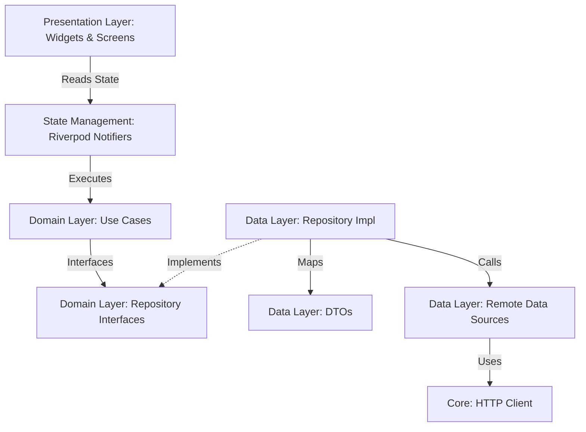
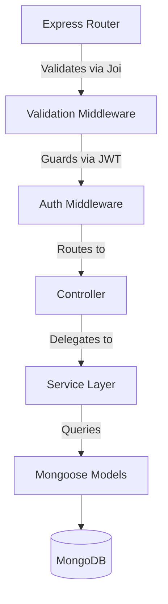
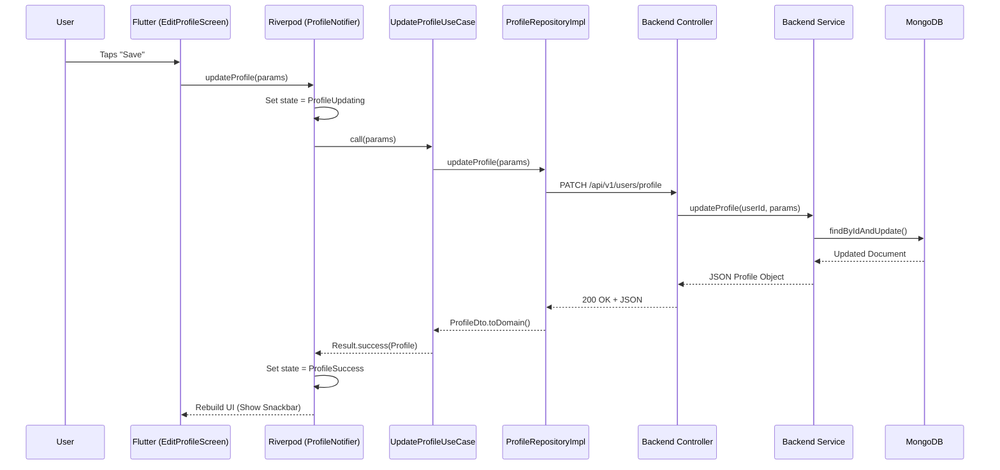
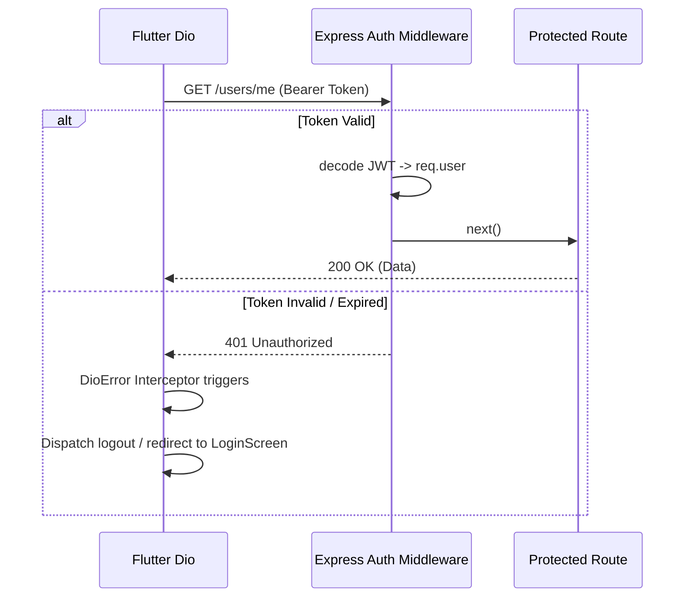

# 03 - System Architecture Handbook

> **Notice**: This document serves as the definitive architectural reference for the CineHub platform. It must remain accurate and synchronized with the current implementation state.

---

## 1. Executive Architecture Overview

### Architecture Philosophy
CineHub is built on the philosophy of **strict separation of concerns** and **predictable state management**. As a social platform for creative professionals, the domain is inherently relational (users, portfolios, skills, social graphs). To ensure that business rules remain unpolluted by UI frameworks or database schemas, CineHub adopts **Clean Architecture** across both the mobile frontend and backend APIs.

### Business Architecture
The system supports the core business objectives of connecting film professionals by providing robust identity management, rich multimedia profiles, and a social graph structure (followers/following). The platform is optimized for reading and querying profiles efficiently while ensuring secure, authenticated write access.

### Technical Architecture
- **Frontend**: Flutter (Dart) using Riverpod for immutable state injection and GoRouter for declarative routing.
- **Backend**: Node.js (Express) providing stateless RESTful APIs.
- **Data Persistence**: MongoDB Atlas (NoSQL) for flexible schema design.
- **Media**: Cloudinary for global CDN delivery and on-the-fly image transformations.

### Tradeoffs
- **Complexity vs. Maintainability**: Clean Architecture requires significant boilerplate (Entities, DTOs, Mappers, Interfaces, UseCases) for simple features. The tradeoff is chosen to ensure long-term maintainability and independent testability.
- **NoSQL vs. SQL**: MongoDB was chosen for flexibility (e.g., dynamic nested arrays for skills and social links) at the cost of strict relational integrity, which is mitigated via application-level enforcement and Mongoose schemas.

### Future Scalability
- **[Planned]** Redis integration for caching heavily queried profiles and feed data.
- **[Planned]** Socket.IO implementation for real-time messaging and notifications.

---

## 2. System Architecture

```mermaid
C4Context
    title CineHub High-Level Architecture
    
    Person(user, "Creative Professional", "Uses the mobile app to network and showcase portfolios.")
    
    System_Boundary(cinehub, "CineHub Platform") {
        System(flutter, "Flutter App", "Mobile Client (iOS/Android)")
        System(nodejs, "Node.js API", "Core Backend Services (Express)")
    }
    
    SystemExt(mongodb, "MongoDB Atlas", "Data Storage")
    SystemExt(cloudinary, "Cloudinary", "Media CDN & Storage")
    SystemExt(redis, "Redis Cache [Future]", "In-memory caching")
    
    Rel(user, flutter, "Interacts with")
    Rel(flutter, nodejs, "API calls (JSON/HTTPS)")
    Rel(flutter, cloudinary, "Fetches optimized images")
    Rel(nodejs, mongodb, "Reads/Writes data (Mongoose)")
    Rel(nodejs, cloudinary, "Uploads raw media (SDK)")
    Rel(nodejs, redis, "Caches responses")
```

---

## 3. Repository Structure

### Root Structure
```text
cinehub/
├── docs/       # [Ownership: Architecture] Project memory and standards.
├── frontend/   # [Ownership: Mobile Team] Flutter application codebase.
└── backend/    # [Ownership: Backend Team] Node.js Express application.
```

### Frontend (`frontend/lib/`)
- `core/`: Config, theming, routing, and HTTP clients. Depend on nothing.
- `features/`: Vertical feature slices (`auth`, `profile`). Isolated domains.
- `shared/`: Generic widgets and utilities used across features.

### Backend (`backend/src/`)
- `api/v1/`: Versioned feature controllers and routes.
- `config/`: Environment and DB connection setups.
- `core/`: Global middlewares (auth, errors) and utilities.
- `models/`: Mongoose schemas.

---

## 4. Frontend Architecture

The frontend uses a strict 3-layer Clean Architecture implemented via feature-sliced directories.



### 1. Presentation Layer
- **Responsibility**: Rendering the UI and listening to state changes.
- **Widgets**: Dumb components (`shared/widgets/`).
- **Screens**: Smart components that watch Riverpod providers.
- **State Management**: Riverpod `Notifier` classes handle mutable feature states (e.g., `ProfileUpdating`).
- **Rule**: Presentation layer MUST NOT contain business logic or raw API calls.

### 2. Domain Layer
- **Responsibility**: Pure business rules.
- **Entities**: Immutable Dart classes representing core concepts (`Profile`, `User`).
- **Use Cases**: Callable classes (e.g., `UpdateProfileUseCase`) that execute specific business actions.
- **Interfaces**: Abstract classes defining data requirements (e.g., `ProfileRepository`).
- **Rule**: Domain layer MUST NOT import flutter/material or http packages.

### 3. Data Layer
- **Responsibility**: Fetching data from APIs and mapping it to Entities.
- **Data Sources**: Classes wrapping Dio HTTP calls (`ProfileRemoteDataSource`).
- **DTOs**: Data Transfer Objects (`ProfileDto`) that parse JSON and contain `.toDomain()` mappers.
- **Repositories**: Implementations of Domain interfaces (`ProfileRepositoryImpl`).

---

## 5. Backend Architecture

The backend utilizes Express.js organized by feature domains rather than technical concerns.



### 1. Routes & Controllers
- **Routes** (`user.route.js`): Maps HTTP methods and paths to middlewares and controllers.
- **Controllers** (`user.controller.js`): Extracts request data (params, body, user), calls the Service, and formats the standard JSON response. Controllers are wrapped in `asyncHandler` to avoid `try/catch` hell.

### 2. Services (Domain)
- **Services** (`user.service.js`): Where the actual business logic lives. Services hash passwords, verify relationships, and manipulate data. They throw `AppError` instances if business rules are violated.

### 3. Models (Data)
- **Models** (`User.js`): Mongoose schemas defining the MongoDB collections. They contain pre-save hooks and instance methods.

---

## 6. Request Lifecycle

### Example: Update Profile



---

## 7. Dependency Flow

Dependencies must point strictly inward toward the Domain layer.

1. `Presentation` depends on `Domain` (for Use Cases) and `Riverpod` (for providers).
2. `Data` depends on `Domain` (to implement Interfaces and map to Entities).
3. `Core` (Networking, Router) depends on external libraries (Dio, GoRouter).
4. `Domain` depends on absolutely nothing but the Dart SDK.

**Why this exists?**
By making the Domain independent, the business logic can be exhaustively unit-tested without needing mock HTTP servers, Flutter testing environments, or actual databases.

---

## 8. Authentication Flow

Authentication is built around short-lived JSON Web Tokens (JWT).

### Implementation Details
- **Frontend Storage**: `flutter_secure_storage` securely holds the JWT.
- **Interceptor**: Dio intercepts every outgoing request. If a token exists, it attaches `Authorization: Bearer <token>`.
- **Backend Guard**: `requireAuth` middleware extracts the token, verifies it via `jsonwebtoken`, and attaches the decoded user payload to `req.user`.



---

## 9. Media Flow

CineHub handles media (avatars) by bypassing database binary storage and utilizing Cloudinary.

### Upload Lifecycle
1. **Frontend**: User selects an image via `image_picker`.
2. **Data Layer**: `ProfileRemoteDataSource` constructs a `MultipartFile` using `FormData`.
3. **Backend Route**: `POST /api/v1/media/upload`.
4. **Middleware**: `multer` intercepts the stream and buffers it in memory.
5. **Controller**: Pipes the buffer stream directly to Cloudinary's upload SDK.
6. **Persistence**: Cloudinary returns a secure URL (`https://res.cloudinary.com/...`). The backend returns this URL to the frontend.
7. **Frontend Update**: The frontend dispatches a `PATCH /profile` request to save the new `avatarUrl` to the user's MongoDB record.

---

## 10. Error Handling

### Backend
- **AppError**: A custom error class extending `Error` containing `statusCode`, `message`, and `isOperational`.
- **Global Error Handler**: Express middleware that catches all `AppError`s (or unhandled exceptions) and returns a standardized JSON structure:
  `{ "status": "error", "message": "...", "code": "..." }`

### Frontend
- **Failure Types**: The App uses a sealed `Result<T, AppError>` wrapper for all Use Cases.
- **Mapping**: Dio exceptions are intercepted in the Data layer and converted into robust `AppError.network`, `AppError.auth`, or `AppError.server` objects.
- **UI**: The Presentation layer listens for `Failure` states and displays them using centralized SnackBars or dedicated `EmptyProfileState` / error widgets.

---

## 11. Performance Considerations

### Current Optimizations
- **Image Caching**: Avatars and network images are inherently cached by the OS/Flutter pipeline, though transitioning to `cached_network_image` is recommended.
- **Pagination**: Social graphs (Followers/Following) use cursor/page-based infinite scrolling, fetching only 20 records at a time to minimize memory and network load.

### Known Bottlenecks
- **Riverpod Future Caching**: `followersProvider` caches `Future`s indefinitely in memory. Pull-to-refresh currently hits the cache rather than the network. Must be addressed by adding `autoDispose` and explicit invalidation.

---

## 12. Scalability

### Current Limitations
- Node.js backend is horizontally scalable but relies on a single MongoDB cluster.
- Chat/Messaging is non-existent.

### Future Architecture
- **[Future] Redis**: Required to cache heavy read operations (like `GET /users/:id` for viral profiles) and to manage session states across distributed Node.js nodes.
- **[Future] Socket.IO**: Required for real-time presence and messaging. Will necessitate a Redis Pub/Sub adapter to sync messages across horizontal server nodes.
- **[Future] Search**: A dedicated search indexing service (like Algolia or Elasticsearch) will be needed when querying users by deeply nested skills and locations becomes slow in MongoDB.

---

## 13. Architecture Decision Records (ADRs)

### ADR-001: Why Clean Architecture?
- **Alternative**: MVC / Feature-Driven standard Flutter (UI calling APIs directly).
- **Decision**: Implemented strict Clean Architecture.
- **Tradeoff**: Increased file count and boilerplate. Gained infinite testability and separation of concerns.

### ADR-002: Why Riverpod?
- **Alternative**: BLoC or Provider.
- **Decision**: Riverpod.
- **Tradeoff**: Steep learning curve. Gained compile-time safety and elimination of `BuildContext` dependency for data injection.

### ADR-003: Why MongoDB?
- **Alternative**: PostgreSQL.
- **Decision**: MongoDB Atlas.
- **Tradeoff**: Lack of strict referential integrity. Gained schema flexibility necessary for highly variable user profiles (nested skills, varying social links) and rapid iteration.

---

## 14. Known Technical Debt

1. **Pagination Caching Issue**: As documented in Section 11, `followersProvider` lacks `autoDispose`. Pull-to-refresh does not clear the cache properly.
2. **Missing Token Refresh**: Currently, the system uses a single long-lived access token. A Refresh Token rotation mechanism needs to be implemented in the backend and frontend interceptors for production security.
3. **Hardcoded Strings**: UI text strings are scattered throughout widgets. A localization mapping strategy (`intl` package) should be adopted before scaling.

---

## 15. Cross References

To dive deeper into specific implementations, refer to the following Brain documents:
- Application Flow & Routing details: See **`05_NAVIGATION.md`**
- API Payload & Response specs: See **`09_API.md`**
- Frontend Design tokens and shared widgets: See **`04_DESIGN_SYSTEM.md`** and **`10_COMPONENT_LIBRARY.md`**
- DB Schemas and Indexing: See **`06_DATABASE.md`**
- Security Checklists: See **`19_SECURITY.md`**
