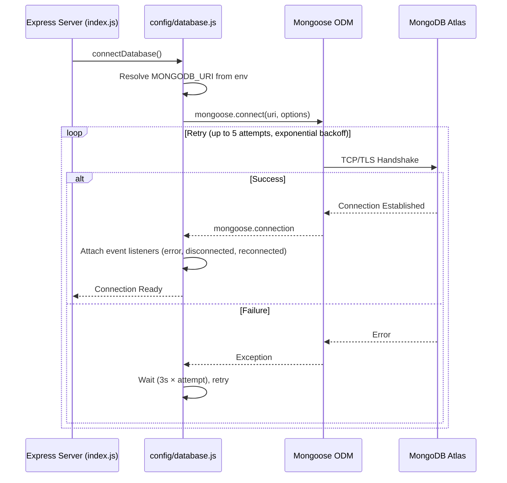
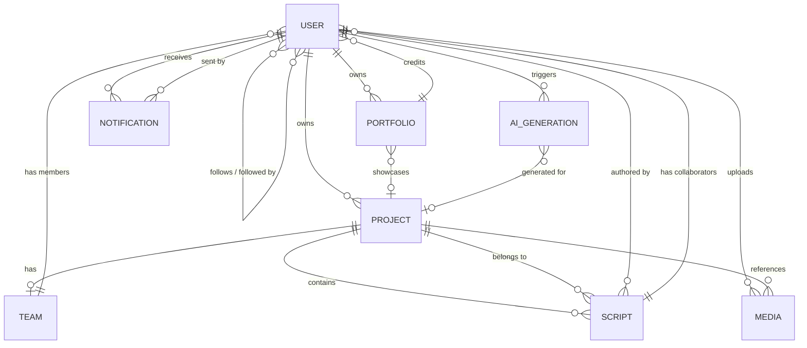
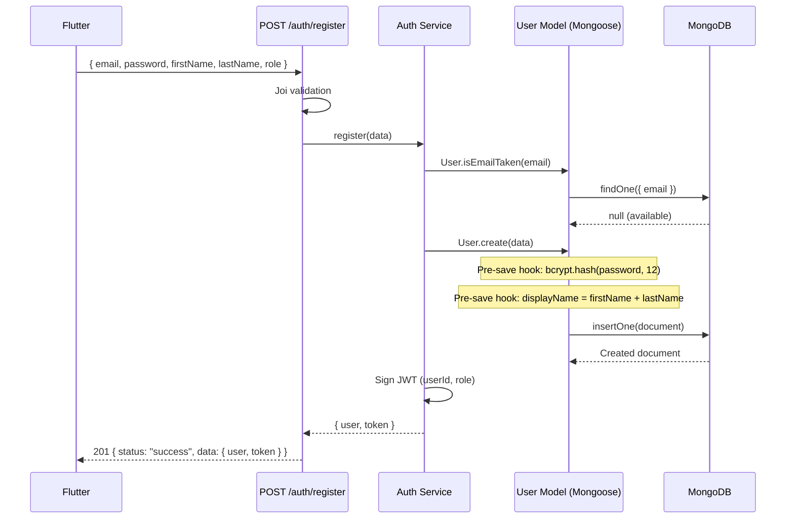
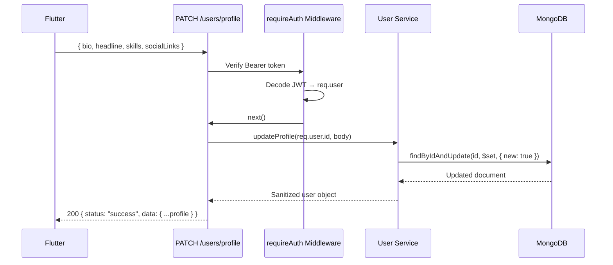
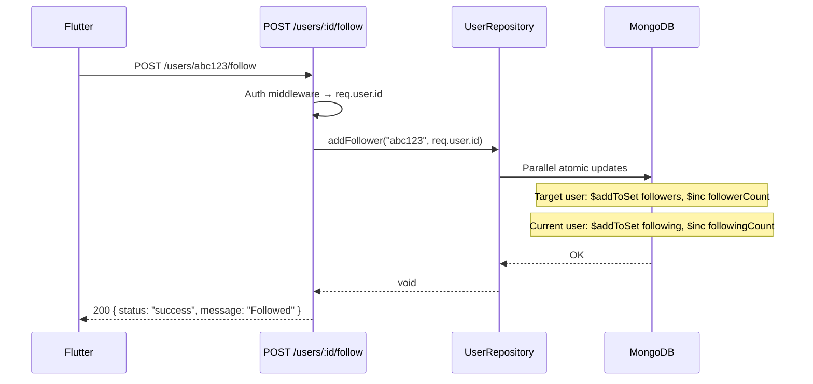

# 06 — Database Architecture Handbook

> **Scope**: This document is the definitive reference for CineHub's data persistence layer. It covers every Mongoose model, index, relationship, plugin, naming convention, and migration strategy. A backend engineer should be able to understand the entire database without opening a single source file.

---

# 1. Database Philosophy

## Why MongoDB?

CineHub's domain is inherently semi-structured. A filmmaker's profile contains optional, nested, and variable-length data: an array of skills with proficiency ratings, a bag of social links, embedded location coordinates, an open-ended experience history, and awards. A traditional relational schema would require 6+ join tables to represent a single user profile, destroying read performance for the most common operation in the app (loading a profile card).

MongoDB's document model allows the **entire user aggregate** to be stored and fetched in a single disk seek, which directly supports the CineHub performance target of < 200ms API response times.

## Why Atlas?

MongoDB Atlas was chosen over self-hosted MongoDB for:
- **Zero-ops clustering**: Automated replica sets, backups, and failover.
- **Global distribution**: Multi-region deployment readiness as the user base grows.
- **Atlas Search**: Native full-text and faceted search without deploying Elasticsearch.
- **Monitoring**: Built-in performance advisor and slow-query profiler.

## Tradeoffs

| Advantage | Tradeoff |
|---|---|
| Flexible schemas for evolving film profiles | No native referential integrity — enforced at application level |
| Single-document reads for complex aggregates | Unbounded array growth (followers stored as ObjectId arrays) can bloat documents |
| Horizontal write scaling via sharding | Transactions span at most a single replica set without extra configuration |
| Schema-less iteration speed | Requires disciplined Mongoose validation to prevent malformed data |

## Design Decisions

1. **Embed vs. Reference**: Small, bounded data (skills, socialLinks, location) is embedded. Unbounded or independently-queryable data (projects, scripts, media) is stored in separate collections and referenced via `ObjectId`.
2. **Denormalized Counters**: `followerCount`, `followingCount`, `projectCount`, `viewCount`, and `likeCount` are stored as denormalized integers on the parent document. They are incremented/decremented atomically via `$inc`. This avoids expensive `$lookup` aggregations on every profile read. The tradeoff is that counters can drift from the true array length if an `$inc` and `$push` are not executed atomically — **this is a known technical debt item** (see Section 15).
3. **Soft Delete over Hard Delete**: All collections use the `softDelete` plugin. Documents are never truly removed — they are flagged with `isDeleted: true`. This protects against accidental data loss and supports future audit trail requirements.

---

# 2. Database Overview

## Connection Flow



## Environment Configuration

| Variable | Required | Default | Description |
|---|---|---|---|
| `MONGODB_URI` | Yes | — | Atlas connection string (production/development) |
| `MONGODB_URI_TEST` | No | — | Override URI for `NODE_ENV=test` |

When `NODE_ENV=test`, the system uses `mongodb-memory-server` to spin up an ephemeral in-memory MongoDB instance, ensuring tests are fast and isolated.

## Connection Pool Settings

Defined in [database.js](file:///z:/newproject/cinehub/backend/src/config/database.js):

| Option | Value | Why |
|---|---|---|
| `maxPoolSize` | 10 | Sufficient for a single-node Express server with moderate concurrency |
| `minPoolSize` | 2 | Keeps two warm connections to avoid cold-start latency |
| `serverSelectionTimeoutMS` | 5000 | Fail fast if Atlas cluster is unreachable |
| `socketTimeoutMS` | 45000 | Long enough for complex aggregations |
| `retryWrites` | true | Automatically retries transient write failures |
| `w` | `'majority'` | Ensures writes are acknowledged by a majority of replica set members |

## Mongoose Plugin Architecture

Every model in CineHub is enhanced by three custom plugins defined in `src/models/plugins/`:

### `toJSON` Plugin
- Renames `_id` → `id` in all serialized output.
- Strips `__v` (Mongoose version key).
- Removes any field marked `{ private: true }` (e.g., `password`, `refreshToken`).
- **Why**: Frontend DTOs expect `id`, not `_id`. Prevents accidental leakage of secrets in API responses.

### `paginate` Plugin
- Adds a static `Model.paginate(filter, options)` method to every model.
- Returns `{ docs, pagination: { totalDocs, totalPages, page, limit, hasNextPage, hasPrevPage, nextPage, prevPage } }`.
- Caps `limit` at 100 to prevent abusive queries.
- **Why**: CineHub paginates followers, following, projects, media, notifications, and portfolio items. A shared plugin ensures consistent pagination response shapes across every endpoint.

### `softDelete` Plugin
- Adds `isDeleted` (Boolean), `deletedAt` (Date), and `deletedBy` (ObjectId ref → User) fields.
- Overrides `find`, `findOne`, `findOneAndUpdate`, and `countDocuments` query middleware to automatically exclude soft-deleted documents unless explicitly opted in via `findWithDeleted()` or `findDeleted()`.
- Provides instance methods: `doc.softDelete(userId)` and `doc.restore()`.
- **Why**: In a creative platform, accidental deletion of a portfolio piece or project could be catastrophic. Soft delete protects against permanent data loss and supports future undo/audit features.

---

# 3. Collections Overview

CineHub currently has **7 Mongoose models** registered via the barrel export in [models/index.js](file:///z:/newproject/cinehub/backend/src/models/index.js):

| Collection | Model File | Status | Plugins | Business Role |
|---|---|---|---|---|
| `users` | `user.model.js` | **[Implemented]** — Actively used by Auth & Profile features | toJSON, paginate, softDelete | Identity, authentication, social graph, skills, location |
| `projects` | `project.model.js` | **[Planned]** — Schema defined, no API routes or frontend integration | toJSON, paginate, softDelete | Film/video production tracking |
| `scripts` | `script.model.js` | **[Planned]** — Schema defined, no API routes or frontend integration | toJSON, paginate, softDelete | AI-generated and manually-authored screenplays |
| `teams` | `team.model.js` | **[Planned]** — Schema defined, no API routes or frontend integration | toJSON, paginate, softDelete | Project collaboration and role-based crew |
| `portfolios` | `portfolio.model.js` | **[Planned]** — Schema defined, no API routes or frontend integration | toJSON, paginate, softDelete | Showcase reels, clips, photos, and posters |
| `notifications` | `notification.model.js` | **[Planned]** — Schema defined, no API routes or frontend integration | toJSON, paginate | Real-time and persistent user notifications |
| `media` | `media.model.js` | **[Planned]** — Schema defined, minimal upload endpoint exists, no metadata persistence | toJSON, paginate, softDelete | File metadata catalog |

> [!IMPORTANT]
> Only the `users` collection is actively read and written by the current API. All other collections have their Mongoose schemas defined and ready, but have **no controllers, services, or frontend integration yet**. This pre-definition was done deliberately to establish the relational contracts early, before building out the features.

---

# 4. Schema Documentation

## 4.1 `users` Collection — **[Implemented]**

**Purpose**: The central identity document. Stores authentication credentials, profile data, professional skills, social graph, and user preferences.

**Source**: [user.model.js](file:///z:/newproject/cinehub/backend/src/models/user.model.js)

### Fields

| Field | Type | Required | Default | Validation | Description |
|---|---|---|---|---|---|
| `email` | String | Yes | — | Unique, trimmed, lowercased | Primary login identifier |
| `password` | String | Yes | — | `minlength: 8`, `private: true` | Bcrypt-hashed password. Never exposed in API responses |
| `role` | String | No | `'user'` | Enum: `user`, `creator`, `producer`, `admin`, `superAdmin` | Determines RBAC permissions |
| `isActive` | Boolean | No | `true` | — | Account activation flag. Soft ban mechanism |
| `isEmailVerified` | Boolean | No | `false` | — | Email verification status |
| `lastLoginAt` | Date | No | — | — | Timestamp of last successful authentication |
| `firstName` | String | Yes | — | `trim`, `maxlength: 50` | Legal first name |
| `lastName` | String | Yes | — | `trim`, `maxlength: 50` | Legal last name |
| `displayName` | String | No | — | `trim`, `maxlength: 100` | Auto-generated from first + last name on save |
| `slug` | String | No | — | Unique, indexed | URL-friendly profile handle (e.g., `/profile/jane-doe`) |
| `bio` | String | No | — | `maxlength: 500` | Free-text biography |
| `headline` | String | No | — | `maxlength: 150` | Professional tagline (e.g., "Director \| Cinematographer") |
| `avatar` | String | No | — | — | Cloudinary URL for profile picture |
| `coverImage` | String | No | — | — | Cloudinary URL for cover photo |
| `skills` | Array | No | `[]` | Subdocument | Professional skills with proficiency rating |
| `skills[].name` | String | Yes | — | — | Skill name (e.g., "Flutter") |
| `skills[].category` | String | No | — | Enum: see `SKILL_CATEGORIES` | Domain grouping (directing, cinematography, etc.) |
| `skills[].proficiency` | Number | No | `3` | `min: 1, max: 5` | Self-assessed proficiency level |
| `experience` | Array | No | `[]` | Subdocument | Work history |
| `experience[].title` | String | No | — | — | Job title |
| `experience[].company` | String | No | — | — | Company/Production name |
| `experience[].description` | String | No | — | — | Role description |
| `experience[].startDate` | Date | No | — | — | Employment start |
| `experience[].endDate` | Date | No | — | — | Employment end (null if current) |
| `experience[].isCurrent` | Boolean | No | `false` | — | Marks active employment |
| `awards` | Array | No | `[]` | Subdocument | Professional accolades |
| `awards[].title` | String | No | — | — | Award name |
| `awards[].organization` | String | No | — | — | Awarding body |
| `awards[].year` | Number | No | — | — | Year received |
| `awards[].description` | String | No | — | — | Award context |
| `location` | Object | No | — | Subdocument | Geographic information |
| `location.city` | String | No | — | — | City name |
| `location.state` | String | No | — | — | State/Province |
| `location.country` | String | No | — | — | Country |
| `location.coordinates` | GeoJSON Point | No | — | `type: 'Point'`, `[lng, lat]` | For geospatial queries |
| `followers` | Array of ObjectId | No | `[]` | Ref → `User` | Users following this user |
| `following` | Array of ObjectId | No | `[]` | Ref → `User` | Users this user follows |
| `followerCount` | Number | No | `0` | Indexed | Denormalized follower count |
| `followingCount` | Number | No | `0` | — | Denormalized following count |
| `projectCount` | Number | No | `0` | — | Denormalized project count |
| `portfolioViewCount` | Number | No | `0` | — | Total portfolio view accumulator |
| `preferences` | Object | No | — | Subdocument | User settings |
| `preferences.emailNotifications` | Boolean | No | `true` | — | Opt-in email alerts |
| `preferences.pushNotifications` | Boolean | No | `true` | — | Opt-in push notifications |
| `preferences.profileVisibility` | String | No | `'public'` | Enum: `public`, `private`, `connections` | Profile privacy setting |
| `preferences.language` | String | No | `'en'` | — | Preferred locale |
| `socialLinks` | Object | No | — | Subdocument | External profile URLs |
| `socialLinks.website` | String | No | — | — | Personal website |
| `socialLinks.imdb` | String | No | — | — | IMDb profile |
| `socialLinks.linkedin` | String | No | — | — | LinkedIn profile |
| `socialLinks.instagram` | String | No | — | — | Instagram handle |
| `socialLinks.youtube` | String | No | — | — | YouTube channel |
| `socialLinks.vimeo` | String | No | — | — | Vimeo portfolio |
| `socialLinks.twitter` | String | No | — | — | X/Twitter handle |
| `refreshToken` | String | No | — | `private: true` | Hashed refresh token. Never exposed in responses |
| `createdAt` | Date | Auto | — | Mongoose `timestamps` | Document creation time |
| `updatedAt` | Date | Auto | — | Mongoose `timestamps` | Last modification time |
| `isDeleted` | Boolean | Auto | `false` | softDelete plugin | Soft deletion flag |
| `deletedAt` | Date | Auto | `null` | softDelete plugin | Soft deletion timestamp |
| `deletedBy` | ObjectId | Auto | `null` | softDelete plugin, Ref → `User` | Who performed the soft delete |

### Virtuals

| Virtual | Returns | Description |
|---|---|---|
| `fullName` | `${firstName} ${lastName}` | Concatenated display name |
| `projects` | Array of `Project` docs | Populated via `ref: 'Project'`, `foreignField: 'owner'` |

### Pre-Save Hooks

1. **Password Hashing**: If `password` is modified, it is hashed using `bcrypt` with configurable salt rounds (default: 12).
2. **Display Name Auto-Generation**: If `firstName` or `lastName` change and `displayName` is not explicitly set, it is regenerated as `"${firstName} ${lastName}"`.

### Instance Methods

| Method | Signature | Returns | Description |
|---|---|---|---|
| `comparePassword` | `(candidatePassword: string)` | `Promise<boolean>` | Compares a plaintext candidate against the stored bcrypt hash |
| `hasRole` | `(role: string)` | `boolean` | Checks if the user holds a specific role |

### Static Methods

| Method | Signature | Returns | Description |
|---|---|---|---|
| `isEmailTaken` | `(email: string, excludeUserId?: string)` | `Promise<boolean>` | Checks email uniqueness, optionally excluding a user (for updates) |

### Example Document

```json
{
  "id": "665f1a2b3c4d5e6f7a8b9c0d",
  "email": "jane.doe@cinehub.ai",
  "role": "creator",
  "isActive": true,
  "isEmailVerified": true,
  "lastLoginAt": "2026-08-01T10:00:00.000Z",
  "firstName": "Jane",
  "lastName": "Doe",
  "displayName": "Jane Doe",
  "slug": "jane-doe",
  "bio": "Award-winning cinematographer based in Mumbai.",
  "headline": "Cinematographer | DOP",
  "avatar": "https://res.cloudinary.com/cinehub/image/upload/v1/avatars/jane.jpg",
  "coverImage": null,
  "skills": [
    { "name": "Cinematography", "category": "cinematography", "proficiency": 5 },
    { "name": "Color Grading", "category": "editing", "proficiency": 4 }
  ],
  "experience": [
    {
      "title": "Director of Photography",
      "company": "Indie Studios",
      "startDate": "2022-01-15T00:00:00.000Z",
      "endDate": null,
      "isCurrent": true
    }
  ],
  "awards": [],
  "location": {
    "city": "Mumbai",
    "state": "Maharashtra",
    "country": "India",
    "coordinates": { "type": "Point", "coordinates": [72.8777, 19.0760] }
  },
  "followers": ["665f1a2b3c4d5e6f7a8b9c0e"],
  "following": [],
  "followerCount": 1,
  "followingCount": 0,
  "projectCount": 0,
  "portfolioViewCount": 0,
  "preferences": {
    "emailNotifications": true,
    "pushNotifications": true,
    "profileVisibility": "public",
    "language": "en"
  },
  "socialLinks": {
    "website": "https://janedoe.film",
    "instagram": "janedoe_dop",
    "linkedin": null,
    "imdb": null,
    "youtube": null,
    "vimeo": null,
    "twitter": null
  },
  "isDeleted": false,
  "deletedAt": null,
  "deletedBy": null,
  "createdAt": "2026-07-01T08:00:00.000Z",
  "updatedAt": "2026-08-01T10:05:00.000Z"
}
```

---

## 4.2 `projects` Collection — **[Planned]**

**Purpose**: Represents a film, short, documentary, or any creative production. The core collaborative entity of CineHub.

**Source**: [project.model.js](file:///z:/newproject/cinehub/backend/src/models/project.model.js)

### Fields

| Field | Type | Required | Default | Validation | Description |
|---|---|---|---|---|---|
| `title` | String | Yes | — | `trim`, `maxlength: 200` | Project name |
| `slug` | String | No | Auto-generated | Unique, indexed | URL-friendly slug (`title` + last 6 chars of `_id`) |
| `tagline` | String | No | — | `maxlength: 300` | Marketing one-liner |
| `synopsis` | String | No | — | `maxlength: 2000` | Short narrative summary |
| `description` | String | No | — | `maxlength: 5000` | Detailed project description |
| `type` | String | Yes | — | Enum: `short_film`, `feature_film`, `documentary`, `web_series`, `music_video`, `commercial`, `animation` | Content classification |
| `status` | String | No | `'draft'` | Enum: `draft`, `pre_production`, `in_production`, `post_production`, `completed`, `archived` | Production lifecycle stage |
| `genres` | Array of String | No | `[]` | trimmed | Genre tags |
| `tags` | Array of String | No | `[]` | trimmed, indexed | Searchable tags |
| `language` | String | No | `'English'` | — | Primary language |
| `owner` | ObjectId | Yes | — | Ref → `User`, indexed | Project creator |
| `poster` | String | No | — | — | Cloudinary URL for poster art |
| `coverImage` | String | No | — | — | Cloudinary URL for cover |
| `trailer` | String | No | — | — | Cloudinary/external URL for trailer |
| `gallery` | Array of String | No | `[]` | — | Array of Cloudinary URLs |
| `budget.estimated` | Number | No | — | — | Estimated budget amount |
| `budget.currency` | String | No | `'USD'` | — | Budget currency code |
| `duration.estimated` | Number | No | — | — | Estimated runtime in minutes |
| `timeline.startDate` | Date | No | — | — | Production start |
| `timeline.endDate` | Date | No | — | — | Production end |
| `timeline.milestones` | Array | No | `[]` | Subdocument | Production milestones (title, date, completed) |
| `locations` | Array | No | `[]` | Subdocument with GeoJSON Point | Filming locations |
| `team` | ObjectId | No | — | Ref → `Team` | Linked Team document |
| `scripts` | Array of ObjectId | No | `[]` | Ref → `Script` | Linked scripts |
| `viewCount` | Number | No | `0` | — | Total views |
| `likeCount` | Number | No | `0` | — | Total likes |
| `shareCount` | Number | No | `0` | — | Total shares |
| `visibility` | String | No | `'private'` | Enum: `public`, `private`, `team_only` | Access control |
| `allowApplications` | Boolean | No | `false` | — | Whether outsiders can apply to join |

### Pre-Save Hook

If `title` is modified, `slug` is auto-generated using `slugify(title) + '-' + _id.slice(-6)` to ensure uniqueness.

---

## 4.3 `scripts` Collection — **[Planned]**

**Purpose**: Stores screenplays, treatments, outlines, and AI-generated scripts. Supports versioning, scene-level structure, and inline comments.

**Source**: [script.model.js](file:///z:/newproject/cinehub/backend/src/models/script.model.js)

### Key Fields

| Field | Type | Required | Description |
|---|---|---|---|
| `title` | String | Yes | Script title |
| `format` | String | Yes | Enum: `screenplay`, `treatment`, `outline`, `beat_sheet`, `logline`, `synopsis` |
| `status` | String | No | Enum: `generating`, `draft`, `in_review`, `approved`, `revision`, `final` |
| `content` | String | No | Main script body (markdown or Fountain format) |
| `logline` | String | No | One-sentence summary |
| `synopsis` | String | No | Extended summary |
| `aiGenerated` | Boolean | No | Marks AI-created scripts |
| `aiMetadata` | Object | No | Provider, model, prompt, token usage, generation time |
| `version` | Number | No | Current version number |
| `versions` | Array | No | Version history with content snapshots and changelogs |
| `scenes` | Array | No | Structured scene breakdown (number, heading, characters, duration) |
| `characters` | Array | No | Character list with role classification and dialogue counts |
| `project` | ObjectId | Yes | Ref → `Project` |
| `author` | ObjectId | Yes | Ref → `User` |
| `collaborators` | Array | No | Users with read/comment/edit permissions |
| `comments` | Array | No | Inline feedback with line references |
| `wordCount` | Number | Auto | Computed on save from `content` |
| `pageCount` | Number | Auto | Computed as `wordCount / 250` (industry standard) |
| `estimatedDuration` | Number | Auto | `pageCount` (~1 minute per page) |

---

## 4.4 `teams` Collection — **[Planned]**

**Purpose**: Models the crew for a film project. Supports invitations, role assignments, granular permissions, and open casting calls.

**Source**: [team.model.js](file:///z:/newproject/cinehub/backend/src/models/team.model.js)

### Key Fields

| Field | Type | Required | Description |
|---|---|---|---|
| `name` | String | Yes | Team name |
| `description` | String | No | Team description |
| `project` | ObjectId | Yes | Ref → `Project` |
| `owner` | ObjectId | Yes | Ref → `User` |
| `members` | Array | No | Array of member subdocuments |
| `members[].user` | ObjectId | Yes | Ref → `User` |
| `members[].role` | String | No | Enum: `owner`, `director`, `producer`, `writer`, `cinematographer`, `editor`, `actor`, `sound_designer`, `art_director`, `vfx_artist`, `composer`, `member` |
| `members[].status` | String | No | Enum: `invited`, `active`, `inactive`, `removed` |
| `members[].permissions` | Object | No | Granular flags: `canEdit`, `canInvite`, `canRemove`, `canManageScripts` |
| `openRoles` | Array | No | Casting-call-style open positions with applicant tracking |
| `maxMembers` | Number | No | Default: 50 |
| `isPublic` | Boolean | No | Default: false |

---

## 4.5 `portfolios` Collection — **[Planned]**

**Purpose**: Individual creative showcases — clips, showreels, photos, posters, and behind-the-scenes content. Each item can reference a Project and list credited collaborators.

**Source**: [portfolio.model.js](file:///z:/newproject/cinehub/backend/src/models/portfolio.model.js)

### Key Fields

| Field | Type | Required | Description |
|---|---|---|---|
| `title` | String | Yes | Portfolio item title |
| `description` | String | No | Item description |
| `type` | String | Yes | Enum: `film`, `clip`, `showreel`, `behind_the_scenes`, `photo`, `poster` |
| `owner` | ObjectId | Yes | Ref → `User` |
| `project` | ObjectId | No | Ref → `Project` (optional link) |
| `media.url` | String | Yes | Primary media Cloudinary URL |
| `media.thumbnail` | String | No | Thumbnail URL |
| `media.type` | String | No | Enum: `image`, `video`, `audio`, `document`, `thumbnail` |
| `credits` | Array | No | Collaborator credits with optional User ref |
| `likes` | Array of ObjectId | No | Ref → `User` |
| `comments` | Array | No | Inline comments |
| `isFeatured` | Boolean | No | Default: false |
| `visibility` | String | No | Enum: `public`, `private`, `unlisted` |
| `order` | Number | No | Portfolio sort order |

---

## 4.6 `notifications` Collection — **[Planned]**

**Purpose**: Persistent notification store for real-time and historical user notifications.

**Source**: [notification.model.js](file:///z:/newproject/cinehub/backend/src/models/notification.model.js)

### Key Fields

| Field | Type | Required | Description |
|---|---|---|---|
| `recipient` | ObjectId | Yes | Ref → `User`, indexed |
| `sender` | ObjectId | No | Ref → `User` |
| `type` | String | Yes | Enum: `system`, `project_invite`, `team_update`, `script_ready`, `collaboration_request`, `portfolio_like`, `portfolio_comment`, `follow`, `mention`, `ai_recommendation` |
| `priority` | String | No | Enum: `low`, `medium`, `high`, `urgent` |
| `title` | String | Yes | Notification title |
| `message` | String | Yes | Notification body |
| `data` | Mixed | No | Arbitrary payload for deep-link context |
| `actionUrl` | String | No | URL target for notification tap |
| `isRead` | Boolean | No | Default: false |
| `readAt` | Date | No | Timestamp when marked read |
| `expiresAt` | Date | No | TTL — auto-deleted after expiry via MongoDB TTL index |

> [!NOTE]
> The notifications collection uses a **TTL index** on `expiresAt` (`{ expireAfterSeconds: 0 }`). MongoDB automatically purges documents after their `expiresAt` date. This is an important self-cleaning mechanism to prevent unbounded collection growth.

---

## 4.7 `media` Collection — **[Planned]**

**Purpose**: Metadata catalog for all uploaded files. Currently, the avatar upload endpoint bypasses this model and stores URLs directly on the User document. Full media cataloging will be implemented with the Portfolio/Project features.

**Source**: [media.model.js](file:///z:/newproject/cinehub/backend/src/models/media.model.js)

### Key Fields

| Field | Type | Required | Description |
|---|---|---|---|
| `filename` | String | Yes | Server-side file name |
| `originalName` | String | Yes | User's original file name |
| `mimeType` | String | Yes | MIME type |
| `type` | String | Yes | Enum: `image`, `video`, `audio`, `document`, `thumbnail` |
| `size` | Number | Yes | File size in bytes |
| `url` | String | Yes | CDN/storage URL |
| `thumbnailUrl` | String | No | Auto-generated thumbnail URL |
| `storageProvider` | String | No | `'local'` or `'s3'` |
| `storagePath` | String | No | Storage path/key |
| `dimensions` | Object | No | `width` and `height` for images/videos |
| `duration` | Number | No | Duration in seconds for video/audio |
| `metadata` | Mixed | No | Arbitrary EXIF/codec metadata |
| `uploadedBy` | ObjectId | Yes | Ref → `User`, indexed |
| `project` | ObjectId | No | Ref → `Project`, indexed |
| `tags` | Array of String | No | Searchable tags |
| `isProcessed` | Boolean | No | Processing completion flag |
| `processingStatus` | String | No | Enum: `pending`, `processing`, `completed`, `failed` |

---

## 4.8 `ai_generations` Collection — **[Planned]**

**Purpose**: Audit log for all AI interactions — script generation, analysis, recommendations. Tracks provider, token usage, latency, and generation status for analytics and billing.

**Source**: [ai-generation.model.js](file:///z:/newproject/cinehub/backend/src/models/ai-generation.model.js)

### Key Fields

| Field | Type | Required | Description |
|---|---|---|---|
| `userId` | ObjectId | Yes | Ref → `User` |
| `module` | String | Yes | Feature area (e.g., `'script'`, `'analysis'`) |
| `task` | String | Yes | Specific task (e.g., `'generate_screenplay'`) |
| `templateId` | String | Yes | Template identifier |
| `input` | Mixed | Yes | User prompt/parameters |
| `output` | Mixed | No | AI-generated output |
| `meta.provider` | String | No | Enum: `openai`, `gemini`, `anthropic` |
| `meta.model` | String | No | Model name (e.g., `gpt-4-turbo`) |
| `meta.tokensUsed` | Number | No | Total tokens consumed |
| `meta.generationTimeMs` | Number | No | Latency in milliseconds |
| `meta.cached` | Boolean | No | Whether the response came from cache |
| `status` | String | No | Enum: `pending`, `completed`, `failed`, `cancelled` |
| `error` | Object | No | Error message and code on failure |
| `projectId` | ObjectId | No | Ref → `Project` |

### Static Helpers
- `AIGeneration.getUserStats(userId, period)`: Returns aggregated usage (total requests, total tokens, average latency) over the last N days.
- `AIGeneration.getHistory(userId, { page, limit, module })`: Paginated generation history with `output` field excluded for performance.

---

# 5. Relationships



### Relationship Implementation Patterns

| Relationship | Pattern | Why |
|---|---|---|
| User ↔ User (follow) | **Embedded ObjectId arrays** (`followers`, `following`) on User document | Fast read access for "is following?" checks. Denormalized counters for display. Tradeoff: unbounded array growth for viral users (see Technical Debt) |
| User → Project | **Reference** (`owner` field on Project) + **Virtual populate** on User | Projects are independently queryable. Virtual populate only resolves on explicit `.populate()` calls to avoid unnecessary joins |
| Project → Team | **Reference** (`team` field on Project, one-to-one) | A project has exactly one team. The team references back to the project |
| Project → Script | **Reference array** (`scripts` field on Project) | Multiple scripts per project. Scripts are large documents — embedding would bloat the Project |
| Media → User / Project | **Reference** (`uploadedBy`, `project` fields) | Media is shared across contexts and must be independently queryable |
| Notification → User | **Reference** (`recipient`, `sender` fields) | Notifications are transient and independently paginated/queried |

---

# 6. Index Strategy

## Current Indexes

### `users` Collection

| Index | Type | Fields | Purpose |
|---|---|---|---|
| Unique | Single | `email` | Prevent duplicate registrations |
| Unique | Single | `slug` | URL-safe profile identifiers |
| Standard | Single | `role` | Filter by user role |
| Compound | Multi | `{ role: 1, isActive: 1 }` | Efficient active-user-by-role queries |
| Text | Multi | `{ firstName, lastName, headline, bio }` | Full-text search for user discovery |
| GeoSpatial | 2dsphere | `location.coordinates` | "Find creators near me" geospatial queries |
| Standard | Single | `skills.name` | Query users by specific skills |
| Standard | Single | `followerCount` | Sort by popularity |
| Standard | Single | `isDeleted` | softDelete plugin auto-filter |

### `projects` Collection

| Index | Type | Fields | Purpose |
|---|---|---|---|
| Unique | Single | `slug` | URL-safe project identifiers |
| Text | Multi | `{ title, synopsis, tags }` | Full-text project search |
| Compound | Multi | `{ owner: 1, status: 1 }` | My projects filtered by stage |
| Compound | Multi | `{ type: 1, status: 1, visibility: 1 }` | Discover projects by type |
| Standard | Descending | `{ createdAt: -1 }` | Default chronological sort |
| Standard | Single | `tags` | Tag-based filtering |

### `scripts` Collection

| Index | Type | Fields | Purpose |
|---|---|---|---|
| Compound | Multi | `{ project: 1, status: 1 }` | Scripts for a project by status |
| Compound | Multi | `{ author: 1, createdAt: -1 }` | My scripts, newest first |
| Text | Multi | `{ title, logline }` | Script search |

### `teams` Collection

| Index | Type | Fields | Purpose |
|---|---|---|---|
| Standard | Single | `project` | Find team by project |
| Standard | Single | `owner` | Find teams owned by user |
| Standard | Single | `members.user` | Find all teams a user belongs to |

### `portfolios` Collection

| Index | Type | Fields | Purpose |
|---|---|---|---|
| Compound | Multi | `{ owner: 1, type: 1 }` | My portfolio items by type |
| Text | Multi | `{ title, tags }` | Portfolio search |
| Standard | Descending | `{ viewCount: -1 }` | Popular items |

### `notifications` Collection

| Index | Type | Fields | Purpose |
|---|---|---|---|
| Compound | Multi | `{ recipient: 1, isRead: 1, createdAt: -1 }` | Unread notifications feed |
| TTL | Single | `{ expiresAt: 1 }` with `expireAfterSeconds: 0` | Automatic expiry/cleanup |
| Standard | Single | `type` | Filter by notification type |

### `media` Collection

| Index | Type | Fields | Purpose |
|---|---|---|---|
| Compound | Multi | `{ uploadedBy: 1, type: 1 }` | User's media by type |
| Standard | Single | `project` | Media for a project |

### `ai_generations` Collection

| Index | Type | Fields | Purpose |
|---|---|---|---|
| Compound | Multi | `{ userId: 1, createdAt: -1 }` | User's AI history |
| Compound | Multi | `{ module: 1, task: 1, createdAt: -1 }` | Analytics by feature/task |
| Standard | Single | `status` | Filter by generation status |
| Standard | Descending | `{ createdAt: -1 }` | Global chronological listing |

---

# 7. Media Strategy

## Current Implementation (Phase 2)

The avatar upload flow bypasses the `media` collection entirely. Here is the actual flow:

1. Flutter calls `POST /api/v1/media/upload` with a `multipart/form-data` body containing the image file.
2. The backend receives the file via `multer` and uploads it to Cloudinary.
3. Cloudinary returns a secure CDN URL (e.g., `https://res.cloudinary.com/cinehub/image/upload/v1/avatars/xyz.jpg`).
4. The backend returns `{ data: { url: "..." } }` to the frontend.
5. The frontend immediately calls `PATCH /api/v1/users/profile` with `{ avatar: url }` to persist the URL in the User document.

**Why no Media document?** For Phase 2 (avatars only), creating a separate Media record for every avatar change adds unnecessary complexity. The Media model is intended for future Portfolio and Project gallery uploads where independent queryability, metadata tracking, and processing status are required.

## Future Media Architecture

When Portfolio and Project features are built:
- Every uploaded file will create a `Media` document storing metadata (MIME type, dimensions, duration, processing status).
- The `media.url` field will store the Cloudinary URL.
- The `media.storageProvider` field supports switching between `'local'` (dev) and `'s3'` (production) without schema changes.
- Video uploads will use asynchronous processing: `processingStatus` will transition from `'pending'` → `'processing'` → `'completed'`/`'failed'`.

## Deletion Policy

Currently, there is no media deletion flow. When implemented:
- Deleting a Portfolio item should soft-delete the associated Media documents.
- A background job should periodically purge Cloudinary assets linked to hard-deleted Media records.

---

# 8. Naming Standards

## Collection Names
- Plural, lowercase: `users`, `projects`, `scripts`, `teams`, `portfolios`, `notifications`, `media`.
- Set explicitly via `{ collection: 'collectionName' }` in schema options to prevent Mongoose auto-pluralization surprises.

## Field Names
- camelCase: `firstName`, `avatarUrl`, `followerCount`.
- Boolean fields use `is`/`has` prefix: `isActive`, `isDeleted`, `isEmailVerified`, `isFeatured`, `isPublic`.
- Count fields use `<noun>Count` suffix: `followerCount`, `viewCount`, `wordCount`.

## ObjectId References
- Named after the singular entity they reference: `owner` (→ User), `project` (→ Project), `author` (→ User), `recipient` (→ User).
- Array references use plural: `followers`, `following`, `scripts`, `collaborators`.

## Timestamps
- All schemas use Mongoose's `{ timestamps: true }`, which auto-creates `createdAt` and `updatedAt` fields.
- Manual date fields follow `<action>At` pattern: `lastLoginAt`, `deletedAt`, `readAt`, `joinedAt`, `invitedAt`, `appliedAt`, `generatedAt`.

## Slug Conventions
- Generated from human-readable titles using `slugify()`.
- Uniqueness ensured by appending last 6 characters of the `_id` (e.g., `my-film-title-a1b2c3`).

---

# 9. Current Collections — Operational Summary

Only the `users` collection is actively used by the current API (Phase 1 Auth + Phase 2 Profile). The table below summarizes operational status:

| Collection | Status | API Endpoints Using It | Frontend Features |
|---|---|---|---|
| `users` | **Active** | `POST /auth/register`, `POST /auth/login`, `POST /auth/forgot-password`, `GET /users/:id`, `PATCH /users/profile`, `POST /users/:id/follow`, `DELETE /users/:id/follow`, `GET /users/:id/followers`, `GET /users/:id/following` | Login, Register, Profile, Edit Profile, Avatar Upload, Followers, Following, Skills Editor, Profile Completion |
| `projects` | Schema Only | None | None |
| `scripts` | Schema Only | None | None |
| `teams` | Schema Only | None | None |
| `portfolios` | Schema Only | None | None |
| `notifications` | Schema Only | None | None |
| `media` | Schema Only | Upload endpoint exists but does NOT create Media documents — it returns URLs directly | Avatar upload (returns URL only) |

---

# 10. Planned Collections

The following collections have their Mongoose schemas fully defined but are **not yet connected** to any API routes or frontend features.

## `projects` — [Planned, Phase 3+]
**Why it will exist**: CineHub's core value proposition is showcasing film projects. A Project links an owner, a team, multiple scripts, media assets, and production timelines into a single collaborative entity.

## `teams` — [Planned, Phase 3+]
**Why it will exist**: Every film is made by a crew. Teams assign industry-specific roles (Director, Cinematographer, Editor) with granular permissions and support open casting calls via `openRoles`.

## `scripts` — [Planned, Phase 3+]
**Why it will exist**: CineHub integrates AI-powered script generation. The Script model supports versioning, structured scene breakdowns, and inline collaborative comments.

## `portfolios` — [Planned, Phase 3+]
**Why it will exist**: Users need to showcase individual creative works (clips, showreels, BTS footage) independently from full project entities. Portfolio items can optionally link to Projects.

## `notifications` — [Planned, Phase 3+]
**Why it will exist**: Follow events, team invitations, script completions, and AI recommendations all require persistent, paginated notification delivery with TTL-based auto-expiry.

## `media` — [Planned, Phase 3+]
**Why it will exist**: The current avatar upload flow stores URLs directly on the User document. When Projects and Portfolios are built, every uploaded asset needs a dedicated metadata record for querying, processing, and lifecycle management.

## Future Collections (Not Yet Defined)

| Collection | Purpose | Expected Phase |
|---|---|---|
| `conversations` | Chat thread metadata | Messaging Phase |
| `messages` | Individual chat messages | Messaging Phase |
| `posts` | Feed/social content | Feed Phase |
| `comments` | Unified comment system | Feed Phase |
| `likes` | Unified like/reaction tracking | Feed Phase |

---

# 11. Data Flow

## Registration



## Profile Update



## Follow User



---

# 12. Performance

## Query Optimization
- **Projection**: Repository methods use `.select()` to return only required fields (e.g., AI generation history excludes `output`).
- **Lean Queries**: `BaseRepository` defaults to `.lean()` for read operations, returning plain JavaScript objects instead of Mongoose documents (skipping hydration overhead).
- **Pagination Cap**: The `paginate` plugin caps `limit` at 100 to prevent abusive bulk queries.

## Known Bottlenecks
1. **Followers/Following Arrays**: The `followers` and `following` arrays on the User document are unbounded. A user with 100K+ followers would have a 100K-element ObjectId array embedded in their document, approaching MongoDB's 16MB document size limit.
2. **Count Denormalization Drift**: The `$inc` on `followerCount` and `$addToSet` on `followers` in `UserRepository.addFollower()` are not wrapped in a transaction. A partial failure could cause the count to drift from the actual array length.

## Future Improvements
- **[Future]** Migrate `followers`/`following` to a dedicated `relationships` collection with `{ follower, followee, createdAt }` documents and compound indexes. This eliminates unbounded array growth.
- **[Future]** Implement Redis caching for `GET /users/:id` with 5-minute TTL to reduce database reads for hot profiles.

---

# 13. Security

## Password Hashing
- Passwords are hashed using `bcryptjs` with configurable salt rounds (default: 12, set via `BCRYPT_SALT_ROUNDS` env var).
- The `password` field is marked `{ private: true }` in the schema, ensuring the `toJSON` plugin strips it from all API responses.

## Sensitive Field Protection
- `refreshToken` is marked `{ private: true }` — never exposed in API responses.
- The `toJSON` plugin iterates all schema paths and removes any field with `options.private === true` during serialization.

## JWT Token Storage
- Access and refresh tokens are signed with separate secrets (`JWT_ACCESS_SECRET`, `JWT_REFRESH_SECRET`), both requiring minimum 32 characters.
- The `refreshToken` field on the User document stores a hashed version, not the raw token.

## Soft Delete & Audit Fields
- All collections with the `softDelete` plugin track `deletedBy` (the ObjectId of the user who performed the deletion), providing an audit trail.

## Upload Validation
- File uploads are constrained by `MAX_FILE_SIZE` (default: 50MB).
- Allowed MIME types are configured via `ALLOWED_IMAGE_TYPES` and `ALLOWED_VIDEO_TYPES` environment variables.

---

# 14. Migration Strategy

## Current Approach
CineHub does not yet have a formal migration framework. Schema evolution has been managed through:
1. **Additive-only changes**: New fields are added with sensible defaults, ensuring backward compatibility.
2. **Optional fields**: Nearly all profile fields (bio, headline, skills, etc.) are optional, preventing breakage when new fields are introduced.
3. **Mongoose validation**: Schema-level validation ensures new documents conform to the current structure.

## Future Migration Policy
When breaking schema changes become necessary:
- **[Future]** Adopt a migration tool (e.g., `migrate-mongo`) to version and track schema changes.
- **Backward Compatibility**: Never rename or remove a field without a deprecation period. Add the new field, migrate data, then remove the old field.
- **Index Changes**: New indexes should be created in the background (`{ background: true }`) to avoid locking the collection during creation on large datasets.

---

# 15. Technical Debt

| ID | Severity | Issue | Impact | Proposed Fix |
|---|---|---|---|---|
| DB-001 | **High** | `followers` and `following` arrays on User document are unbounded | A viral user with millions of followers will hit the 16MB BSON document limit | Migrate to a dedicated `relationships` collection |
| DB-002 | **Medium** | `followerCount` `$inc` and `followers` `$addToSet` are not transactional | Partial failure causes count/array mismatch | Wrap in a Mongoose multi-document transaction |
| DB-003 | **Medium** | Media upload endpoint does not persist `Media` documents | No metadata tracking for uploaded avatars; cannot query or manage uploads | Create Media record on every upload, store `mediaId` on User |
| DB-004 | **Low** | No migration framework in place | Manual schema evolution without version tracking | Integrate `migrate-mongo` or similar |
| DB-005 | **Low** | `AIGeneration` model does not use `softDelete` plugin | AI generation records are hard-deletable | Add `softDelete` plugin for consistency |

---

# 16. Cross References

| Topic | Brain Document |
|---|---|
| System Architecture & Clean Architecture flow | [03_ARCHITECTURE.md](file:///z:/newproject/cinehub/docs/brain/03_ARCHITECTURE.md) |
| Backend folder structure, services, and controllers | [07_BACKEND.md](file:///z:/newproject/cinehub/docs/brain/07_BACKEND.md) |
| API endpoints, request/response payloads | [09_API.md](file:///z:/newproject/cinehub/docs/brain/09_API.md) |
| Phase completion status and acceptance criteria | [13_PHASES.md](file:///z:/newproject/cinehub/docs/brain/13_PHASES.md) |
| Architecture Decision Records | [16_DECISIONS.md](file:///z:/newproject/cinehub/docs/brain/16_DECISIONS.md) |
| Security checklists and authentication | [19_SECURITY.md](file:///z:/newproject/cinehub/docs/brain/19_SECURITY.md) |
