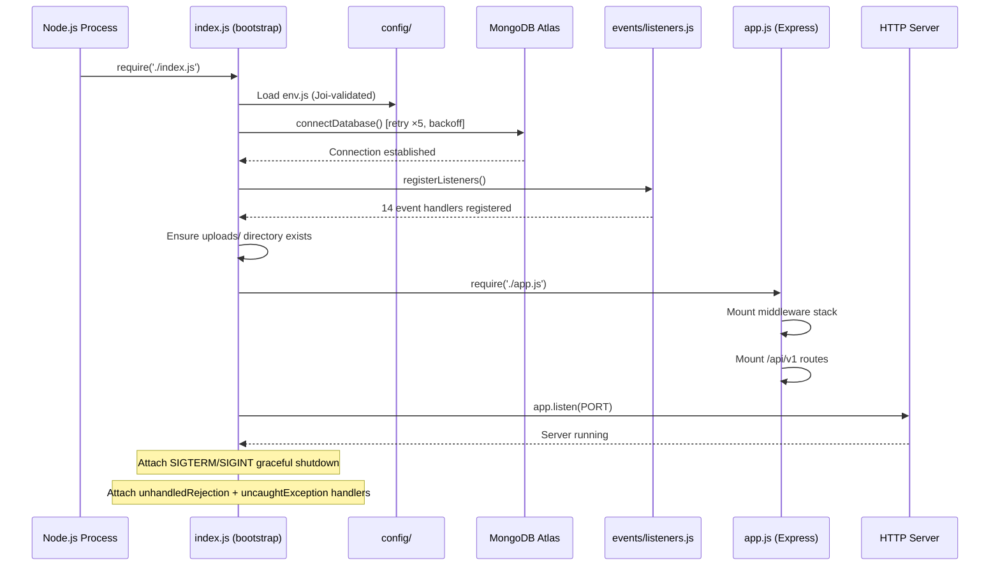
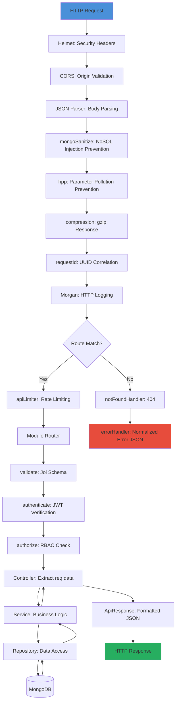
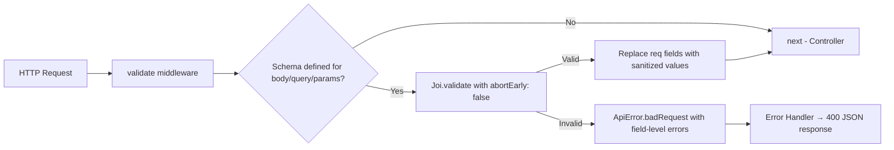

# 07 — Backend Engineering Handbook

> **Scope**: This document is the definitive reference for CineHub's Node.js/Express backend. It covers the server bootstrap process, every middleware, every API module, the repository pattern, event system, integrations, error handling, security, and operational concerns. A backend engineer should be able to maintain and extend this system without reading most of the source code.

---

# 1. Backend Philosophy

## Why Express?

Express was chosen as the HTTP framework for CineHub because:
- **Maturity**: The most battle-tested Node.js framework with the largest middleware ecosystem.
- **Simplicity**: Thin abstraction layer that does not impose opinions on project structure, allowing CineHub to enforce its own layered architecture.
- **Performance**: Minimal overhead per request. Combined with Node.js's event loop, it handles high-concurrency I/O (database reads, Cloudinary uploads) efficiently.

## Why a Layered Architecture?

CineHub's backend enforces a strict separation between **Routes → Controllers → Services → Repositories → Models**. This is not MVC — it is a layered domain architecture where each layer has a single responsibility:

| Layer | Responsibility | Allowed To Call | Never Calls |
|---|---|---|---|
| **Routes** | HTTP method/path mapping + middleware chaining | Controller functions | Services, Repositories, Models directly |
| **Controllers** | Extract `req` params, delegate to Service, format `res` | Service methods, `ApiResponse`, `catchAsync` | Repositories, Models directly |
| **Services** | Business logic, validation, orchestration | Repositories, Event Emitter, Integrations | `req`, `res`, HTTP concerns |
| **Repositories** | Data access patterns (CRUD, pagination, aggregation) | Mongoose Models | Services, Controllers |
| **Models** | Schema definition, hooks, instance methods | MongoDB (via Mongoose) | Everything else |

**Why this exists?** In a creative-professional platform with complex domain logic (social graphs, team permissions, AI script generation), mixing HTTP concerns with business rules creates brittle, untestable code. By isolating the Service layer from Express, every business rule can be unit-tested without HTTP mocking.

## Tradeoffs

- **More files per feature**: Each API module has 4 files (routes, controller, service, validation). This is accepted to ensure testability and clarity.
- **Singleton services/repositories**: Services and repositories are exported as singleton instances (`module.exports = new UserService()`). This simplifies DI but makes testing harder without dependency injection frameworks. For now, this is acceptable given the project's size.

---

# 2. Complete Backend Architecture

## Bootstrap Sequence



## Graceful Shutdown

On `SIGTERM` or `SIGINT`:
1. Stop accepting new HTTP connections (`server.close()`).
2. Disconnect from MongoDB (`disconnectDatabase()`).
3. Disconnect from Redis (`disconnectRedis()`).
4. Exit with code 0.

On `uncaughtException`: Log the stack trace, then trigger the same graceful shutdown sequence.

---

# 3. Folder Structure

```text
backend/src/
├── index.js                    # Entry point — bootstrap + shutdown
├── app.js                      # Express instance — middleware + routes
│
├── config/                     # Environment, DB, Redis, Logger
│   ├── env.js                  # Joi-validated environment config
│   ├── database.js             # MongoDB connection with retry logic
│   ├── redis.js                # Redis singleton client (ioredis)
│   ├── logger.js               # Winston structured logging
│   └── index.js                # Barrel export
│
├── middleware/                  # Express middleware
│   ├── auth.middleware.js       # JWT authentication
│   ├── rbac.middleware.js       # Role-based access control
│   ├── validate.middleware.js   # Joi request validation
│   ├── errorHandler.middleware.js # Global error normalizer
│   ├── rateLimiter.middleware.js # Tiered rate limiters
│   ├── upload.middleware.js     # Multer file upload presets
│   ├── requestId.middleware.js  # UUID request correlation
│   └── index.js                # Barrel export
│
├── api/v1/                     # Versioned API modules
│   ├── index.js                # V1 router aggregator + health check
│   ├── auth/                   # [Implemented] Authentication
│   ├── users/                  # [Implemented] User profiles + social
│   ├── media/                  # [Partially Implemented] File uploads
│   ├── projects/               # [Planned] Film projects
│   ├── scripts/                # [Planned] AI scripts
│   ├── teams/                  # [Planned] Crew teams
│   ├── portfolios/             # [Planned] Portfolio items
│   ├── notifications/          # [Planned] Notifications
│   ├── discovery/              # [Planned] Search & discovery
│   └── ai/                     # [Planned] AI generation
│
├── models/                     # Mongoose schemas
│   ├── plugins/                # toJSON, paginate, softDelete
│   └── *.model.js              # 7 domain models
│
├── repositories/               # Data access layer
│   ├── base.repository.js      # Abstract CRUD + pagination
│   └── *.repository.js         # Domain-specific queries
│
├── events/                     # Domain event system
│   ├── emitter.js              # Singleton EventEmitter
│   └── listeners.js            # Side-effect handlers
│
├── integrations/               # External service adapters
│   ├── ai/                     # [Planned] AI gateway (OpenAI/Gemini)
│   ├── email/                  # Email via Nodemailer + Handlebars
│   └── storage/                # Local + S3 file storage
│
└── utils/                      # Shared utilities
    ├── ApiError.js             # Operational error class
    ├── ApiResponse.js          # Standardized response envelope
    ├── catchAsync.js           # Async error wrapper
    ├── constants.js            # Domain enums
    ├── pagination.js           # Pagination param parser
    ├── pick.js                 # Object key extractor
    └── token.js                # JWT generation/verification
```

### Dependency Rules

| Source | May Import | Must NOT Import |
|---|---|---|
| `api/v1/<module>/` | `middleware/`, `utils/`, `repositories/`, `models/`, `events/emitter`, `config/` | Other `api/v1/<module>/` modules directly |
| `middleware/` | `utils/`, `config/`, `models/` | `api/`, `repositories/`, `events/` |
| `repositories/` | `models/`, `utils/` | `api/`, `middleware/`, `config/` (except Mongoose) |
| `integrations/` | `config/`, `utils/` | `api/`, `middleware/`, `repositories/` |
| `events/` | `config/`, `api/v1/*/` (only for notifications) | `middleware/` |

---

# 4. API Versioning

All routes are mounted under `/api/v1/`. The v1 router applies the global `apiLimiter` rate limiter before dispatching to individual module routers.

**Current Module Mounting** (from [api/v1/index.js](file:///z:/newproject/cinehub/backend/src/api/v1/index.js)):

| Path | Module | Status |
|---|---|---|
| `/auth` | Authentication | **[Implemented]** |
| `/users` | User Profiles & Social Graph | **[Implemented]** |
| `/media` | Media Uploads | **[Partially Implemented]** |
| `/projects` | Film Projects | **[Planned]** — Routes exist, minimal controller logic |
| `/scripts` | AI Scripts | **[Planned]** |
| `/teams` | Crew Teams | **[Planned]** |
| `/portfolios` | Portfolio Items | **[Planned]** |
| `/notifications` | Notifications | **[Planned]** |
| `/discovery` | Search & Discovery | **[Planned]** |
| `/ai` | AI Generation | **[Planned]** |
| `/health` | System Health Check | **[Implemented]** |

**Future Version Strategy**: When breaking API changes are required, a `/api/v2/` router will be created. V1 endpoints will remain available with deprecation headers for a minimum of 6 months.

---

# 5. Request Lifecycle

Every HTTP request traverses the following pipeline:



---

# 6. Controllers

## Implemented Controllers

### Auth Controller — [auth.controller.js](file:///z:/newproject/cinehub/backend/src/api/v1/auth/auth.controller.js)

| Method | Route | Middleware | Description |
|---|---|---|---|
| `register` | `POST /auth/register` | `authLimiter`, `validate` | Create account, return user + tokens |
| `login` | `POST /auth/login` | `authLimiter`, `validate` | Authenticate, return user + tokens |
| `refreshTokens` | `POST /auth/refresh-tokens` | `validate` | Exchange refresh token for new pair |
| `logout` | `POST /auth/logout` | `authenticate` | Invalidate refresh token |
| `forgotPassword` | `POST /auth/forgot-password` | `sensitiveOpLimiter`, `validate` | Emit password reset event |
| `resetPassword` | `POST /auth/reset-password` | `sensitiveOpLimiter`, `validate` | Verify reset token, update password |
| `changePassword` | `POST /auth/change-password` | `authenticate`, `validate` | Verify current password, set new |
| `verifyEmail` | `GET /auth/verify-email` | `validate` | Mark email as verified via token |
| `getMe` | `GET /auth/me` | `authenticate` | Return current authenticated user |

### User Controller — [user.controller.js](file:///z:/newproject/cinehub/backend/src/api/v1/users/user.controller.js)

| Method | Route | Middleware | Description |
|---|---|---|---|
| `getUser` | `GET /users/:id` | `validate` | Public profile by ID |
| `updateProfile` | `PATCH /users/profile` | `authenticate`, `validate` | Update own profile fields |
| `listUsers` | `GET /users/` | `authenticate`, `validate` | Paginated user search/filter |
| `followUser` | `POST /users/:id/follow` | `authenticate` | Follow a user |
| `unfollowUser` | `DELETE /users/:id/follow` | `authenticate` | Unfollow a user |
| `getFollowers` | `GET /users/:id/followers` | `validate` | Paginated followers list |
| `getFollowing` | `GET /users/:id/following` | `validate` | Paginated following list |

### Controller Rules
1. **No business logic**: Controllers extract data from `req`, call a service method, and send a response via `ApiResponse`.
2. **No direct model access**: Controllers never call `User.find()` directly.
3. **Always wrapped in `catchAsync`**: Eliminates try/catch boilerplate; unhandled rejections are forwarded to the global error handler.

---

# 7. Services

## Implemented Services

### AuthService — [auth.service.js](file:///z:/newproject/cinehub/backend/src/api/v1/auth/auth.service.js)

| Method | Business Logic |
|---|---|
| `register(userData)` | Check email uniqueness, create user, generate slug, emit `user:registered`, return sanitized user + tokens |
| `login(email, password)` | Lookup by email, compare bcrypt hash, check `isActive`, generate tokens, update `lastLoginAt`, emit `user:loggedIn` |
| `refreshTokens(refreshToken)` | Verify refresh JWT, match against stored token, rotate token pair |
| `logout(userId)` | Clear stored `refreshToken` |
| `forgotPassword(email)` | Silent lookup (no email enumeration), generate reset token, emit `user:forgotPassword` |
| `resetPassword(token, newPassword)` | Verify reset JWT type, update password (triggers bcrypt pre-save hook), clear refresh token |
| `changePassword(userId, current, new)` | Re-fetch user with password field, compare current, save new |
| `verifyEmail(token)` | Verify email JWT type, set `isEmailVerified: true` |

### UserService — [user.service.js](file:///z:/newproject/cinehub/backend/src/api/v1/users/user.service.js)

| Method | Business Logic |
|---|---|
| `getUserById(id)` | Find user with virtual `projects` population, throw 404 if missing |
| `updateProfile(userId, updateData)` | Delegate to repository `updateById`, throw 404 if missing |
| `listUsers(filter, options)` | Build MongoDB query from filter (role, skill regex, $or search), paginate |
| `followUser(currentId, targetId)` | Prevent self-follow, verify target exists, delegate to `userRepo.addFollower`, emit `user:followed` |
| `unfollowUser(currentId, targetId)` | Delegate to `userRepo.removeFollower` |
| `getFollowers(userId, options)` | Fetch user, paginate users whose `_id` is in the `followers` array |
| `getFollowing(userId, options)` | Fetch user, paginate users whose `_id` is in the `following` array |

### MediaService — [media.routes.js](file:///z:/newproject/cinehub/backend/src/api/v1/media/media.routes.js) (inline)

> [!NOTE]
> The MediaService is currently defined inline in `media.routes.js` rather than in a separate file. This is a structural inconsistency that should be refactored.

| Method | Business Logic |
|---|---|
| `uploadMedia(userId, file, metadata)` | Create `Media` document with file metadata, auto-detect media type from MIME |
| `getById(id)` | Find media by ID, throw 404 |
| `getByProject(projectId, options)` | Paginated media for a project |
| `getMyMedia(userId, options)` | Paginated media uploaded by user |
| `deleteMedia(id, userId)` | Verify ownership, soft-delete |
| `getStorageUsage(userId)` | Aggregation pipeline: group by type, sum sizes |

---

# 8. Repository Layer

## BaseRepository — [base.repository.js](file:///z:/newproject/cinehub/backend/src/repositories/base.repository.js)

An abstract class providing generic CRUD operations. All domain repositories extend it.

| Method | Signature | Description |
|---|---|---|
| `create` | `(data)` | Insert a new document |
| `findById` | `(id, options)` | Find by `_id` with optional populate/select/lean |
| `findOne` | `(filter, options)` | Find first matching document |
| `find` | `(filter, options)` | Find all matching with sort/skip/limit/populate |
| `paginate` | `(filter, options)` | Delegates to the Mongoose `paginate` plugin |
| `updateById` | `(id, data)` | `findByIdAndUpdate` with `{ new: true, runValidators: true }` |
| `softDeleteById` | `(id, userId)` | Calls `doc.softDelete(userId)` instance method |
| `count` | `(filter)` | `countDocuments` |
| `exists` | `(filter)` | Boolean existence check |
| `aggregate` | `(pipeline)` | Raw aggregation pipeline |
| `bulkWrite` | `(operations)` | Bulk write operations |

**Design Decision**: All read queries default to `.lean()` for performance (returns plain JS objects, skips Mongoose document hydration). This is configurable via `options.lean: false` when instance methods or save hooks are needed.

## Domain Repositories

| Repository | Extends | Extra Methods |
|---|---|---|
| `UserRepository` | `BaseRepository(User)` | `findByEmail`, `findBySlug`, `searchUsers` (text index), `findBySkills`, `findNearLocation` (geospatial), `addFollower`, `removeFollower`, `getTopCreators` |
| `MediaRepository` | `BaseRepository(Media)` | `findByUploader`, `findByProject`, `findByType`, `updateProcessingStatus`, `getStorageUsage` (aggregation) |
| `ProjectRepository` | `BaseRepository(Project)` | Custom project queries |
| `ScriptRepository` | `BaseRepository(Script)` | Custom script queries |
| `TeamRepository` | `BaseRepository(Team)` | Custom team queries |
| `PortfolioRepository` | `BaseRepository(Portfolio)` | Custom portfolio queries |
| `NotificationRepository` | `BaseRepository(Notification)` | Custom notification queries |

---

# 9. Validation

## Joi Validation Flow

CineHub validates every incoming request using Joi schemas before the request reaches the controller.



**Key Design Decisions**:
- `abortEarly: false`: All validation errors are collected and returned at once, not one at a time.
- Validated values **replace** the original `req.body` / `req.query` / `req.params`, ensuring downstream code works with sanitized data.
- ObjectId validation uses a custom `Joi.objectId()` method: `Joi.string().pattern(/^[0-9a-fA-F]{24}$/)`.

## Implemented Validation Schemas

### Auth Validations — [auth.validation.js](file:///z:/newproject/cinehub/backend/src/api/v1/auth/auth.validation.js)

| Schema | Validates | Key Rules |
|---|---|---|
| `register` | `body` | `email` (valid email), `password` (min 8, uppercase+lowercase+digit), `firstName`/`lastName` (max 50), `role` (enum: user/creator/producer) |
| `login` | `body` | `email` (required), `password` (required) |
| `refreshTokens` | `body` | `refreshToken` (required string) |
| `forgotPassword` | `body` | `email` (valid email) |
| `resetPassword` | `body` | `token` (required), `password` (min 8) |
| `verifyEmail` | `query` | `token` (required) |
| `changePassword` | `body` | `currentPassword` (required), `newPassword` (min 8, must differ from current) |

### User Validations — [user.validation.js](file:///z:/newproject/cinehub/backend/src/api/v1/users/user.validation.js)

| Schema | Validates | Key Rules |
|---|---|---|
| `getUser` | `params` | `id` (valid ObjectId) |
| `updateProfile` | `body` | `firstName` (max 50), `bio` (max 500), `headline` (max 150), `skills` (array max 20, proficiency 1–5), `socialLinks` (URIs), `preferences`. At least one field required (`.min(1)`) |
| `listUsers` | `query` | `search` (max 100), `role` (enum), `skill`, `page` (int ≥1), `limit` (int 1–100), `sortBy` |

---

# 10. Authentication

## JWT Token Architecture

CineHub uses a **dual-token strategy** with separate secrets for access and refresh tokens.

| Token Type | Secret | Expiry | Purpose |
|---|---|---|---|
| `access` | `JWT_ACCESS_SECRET` (min 32 chars) | `15m` (configurable) | Short-lived API authorization |
| `refresh` | `JWT_REFRESH_SECRET` (min 32 chars) | `7d` (configurable) | Token renewal without re-login |
| `resetPassword` | `JWT_ACCESS_SECRET` | `10m` | One-time password reset link |
| `verifyEmail` | `JWT_ACCESS_SECRET` | `24h` | One-time email verification link |

### Token Payload Structure

```json
{
  "sub": "665f1a2b3c4d5e6f7a8b9c0d",
  "role": "creator",
  "type": "access",
  "iss": "CineHub",
  "aud": "http://localhost:5000",
  "iat": 1722700000,
  "exp": 1722700900
}
```

### Authentication Flow

```mermaid
sequenceDiagram
    participant Client as Flutter App
    participant Auth as authenticate() Middleware
    participant JWT as token.js (verifyToken)
    participant DB as User Model
    participant Route as Protected Route

    Client->>Auth: Authorization: Bearer <accessToken>
    Auth->>JWT: verifyToken(token, accessSecret)
    alt Valid Token
        JWT-->>Auth: { sub, role, type: 'access' }
        Auth->>DB: User.findById(sub).select('-password')
        alt User Exists & Active
            DB-->>Auth: User document
            Auth->>Auth: req.user = user; req.tokenPayload = decoded
            Auth->>Route: next()
        else User Not Found
            Auth-->>Client: 401 AUTH_USER_NOT_FOUND
        else Account Deactivated
            Auth-->>Client: 403 AUTH_ACCOUNT_DEACTIVATED
        end
    else Token Expired
        JWT-->>Auth: ApiError AUTH_TOKEN_EXPIRED
        Auth-->>Client: 401 Token has expired
    else Invalid Token
        JWT-->>Auth: ApiError AUTH_TOKEN_INVALID
        Auth-->>Client: 401 Invalid token
    end
```

### Optional Authentication

The `authenticate()` middleware supports `{ optional: true }` mode. When the token is missing, `req.user = null` and the request continues. This is useful for public endpoints that provide enhanced data for logged-in users (e.g., showing "is following" badges on public profiles).

---

# 11. Middleware

## Complete Middleware Stack

Middleware executes in the order defined in [app.js](file:///z:/newproject/cinehub/backend/src/app.js):

| Order | Middleware | Source | Purpose |
|---|---|---|---|
| 1 | `helmet()` | npm: `helmet` | Sets security HTTP headers (X-Frame-Options, X-Content-Type-Options, etc.). CSP disabled in dev |
| 2 | `cors()` | npm: `cors` | Restricts origins to `CLIENT_URL`. Allows credentials. Exposes `X-Request-Id` |
| 3 | `express.json()` | Express built-in | Parses JSON bodies up to 10MB |
| 4 | `express.urlencoded()` | Express built-in | Parses URL-encoded bodies up to 10MB |
| 5 | `mongoSanitize()` | npm: `express-mongo-sanitize` | Strips `$` and `.` from user input to prevent NoSQL injection |
| 6 | `hpp()` | npm: `hpp` | Prevents HTTP parameter pollution attacks |
| 7 | `compression()` | npm: `compression` | Gzips response bodies |
| 8 | `requestId` | Custom | Attaches UUID (`req.id`) and `X-Request-Id` response header |
| 9 | `morgan('short')` | npm: `morgan` | HTTP request logging piped to Winston. Disabled in test |
| 10 | `express.static('/uploads')` | Express built-in | Serves uploaded files from local filesystem |
| 11 | `apiLimiter` | Custom | Global rate limiter on all `/api/v1` routes |

## Route-Level Middleware

| Middleware | File | Purpose | Failure Behavior |
|---|---|---|---|
| `authenticate(options?)` | `auth.middleware.js` | Verifies Bearer JWT, attaches `req.user` | 401 Unauthorized (or pass-through if `optional: true`) |
| `authorize(...roles)` | `rbac.middleware.js` | Checks `req.user.role` against allowed roles | 403 Forbidden |
| `authorizeOwnerOrAdmin(paramField?)` | `rbac.middleware.js` | Checks if `req.user._id` matches `req.params[field]` or user is admin | 403 Forbidden |
| `validate(schema)` | `validate.middleware.js` | Runs Joi validation on body/query/params | 400 Bad Request with field-level errors |
| `uploadImage.single('file')` | `upload.middleware.js` | Multer preset for images (10MB, JPEG/PNG/WebP/GIF) | 400 Invalid file type or file too large |
| `uploadVideo.single('file')` | `upload.middleware.js` | Multer preset for videos (50MB, MP4/WebM/QuickTime) | 400 Invalid file type or file too large |
| `uploadMedia.single('file')` | `upload.middleware.js` | Combined image+video preset | 400 errors as above |
| `uploadToMemory` | `upload.middleware.js` | Memory storage for image processing before saving | 400 errors as above |

## Rate Limiters

| Limiter | Window | Max Requests | Applied To |
|---|---|---|---|
| `apiLimiter` | 15 min (configurable) | 100 (configurable) | All `/api/v1` routes |
| `authLimiter` | 15 min | 20 | Login, Register |
| `sensitiveOpLimiter` | 1 hour | 5 | Forgot Password, Reset Password |
| `aiLimiter` | 1 hour | 30 | AI generation endpoints |

**Key Design**: Rate limiter keys are per-user (`user:<id>`) for authenticated requests and per-IP for anonymous ones. This prevents a single user from exhausting the limit for all users behind a shared IP.

---

# 12. Error Handling

## ApiError Class — [ApiError.js](file:///z:/newproject/cinehub/backend/src/utils/ApiError.js)

Every expected failure in CineHub is thrown as an `ApiError` instance. This class provides:
- **`statusCode`**: HTTP status code (400, 401, 403, 404, 409, 429, 500, 503).
- **`message`**: Human-readable error string.
- **`code`**: Machine-readable error code (e.g., `AUTH_TOKEN_EXPIRED`, `VALIDATION_ERROR`).
- **`errors`**: Array of field-level validation errors.
- **`isOperational`**: Distinguishes expected errors from programmer bugs.

### Factory Methods

| Factory | HTTP Status | Use Case |
|---|---|---|
| `ApiError.badRequest()` | 400 | Invalid input, validation failure |
| `ApiError.unauthorized()` | 401 | Missing/invalid/expired JWT |
| `ApiError.forbidden()` | 403 | Insufficient role or not owner |
| `ApiError.notFound()` | 404 | Resource does not exist |
| `ApiError.conflict()` | 409 | Duplicate key (email already taken) |
| `ApiError.tooManyRequests()` | 429 | Rate limit exceeded |
| `ApiError.internal()` | 500 | Unexpected server error (`isOperational: false`) |
| `ApiError.serviceUnavailable()` | 503 | External service down |

## Global Error Handler — [errorHandler.middleware.js](file:///z:/newproject/cinehub/backend/src/middleware/errorHandler.middleware.js)

The global error handler normalizes **all** error types into `ApiError`:

| Error Source | Normalization |
|---|---|
| `ApiError` instance | Passed through unchanged |
| Mongoose `ValidationError` | Mapped to 400 `MONGOOSE_VALIDATION` with field-level errors |
| Mongoose `CastError` | Mapped to 400 `INVALID_ID` (e.g., invalid ObjectId format) |
| MongoDB error code `11000` | Mapped to 409 `DUPLICATE_KEY` with the conflicting field name |
| Multer `LIMIT_FILE_SIZE` | Mapped to 400 `FILE_TOO_LARGE` |
| Multer `LIMIT_UNEXPECTED_FILE` | Mapped to 400 `UNEXPECTED_FILE` |
| `SyntaxError` (JSON body) | Mapped to 400 `INVALID_JSON` |
| Unknown errors | Mapped to 500 Internal Server Error (`isOperational: false`) |

### Response Format

```json
{
  "status": "error",
  "statusCode": 400,
  "message": "Validation failed",
  "code": "VALIDATION_ERROR",
  "errors": [
    { "field": "body.email", "message": "email must be a valid email", "type": "string.email" }
  ]
}
```

In development mode, the `stack` trace is included. In production, it is suppressed.

### Logging Behavior
- `statusCode >= 500`: Logged at `error` level with full stack trace and `requestId`.
- `statusCode < 500`: Logged at `warn` level.

---

# 13. Configuration

## Environment Variables — [env.js](file:///z:/newproject/cinehub/backend/src/config/env.js)

All environment variables are validated at startup using Joi. If any required variable is missing, the process exits immediately with a descriptive error.

| Category | Variables | Description |
|---|---|---|
| **Application** | `NODE_ENV`, `PORT`, `API_PREFIX`, `APP_NAME`, `APP_URL`, `CLIENT_URL` | Core app settings |
| **Database** | `MONGODB_URI`, `MONGODB_URI_TEST` | MongoDB Atlas connection strings |
| **Redis** | `REDIS_HOST`, `REDIS_PORT`, `REDIS_PASSWORD`, `REDIS_DB` | Redis connection for caching/queues |
| **JWT** | `JWT_ACCESS_SECRET`, `JWT_REFRESH_SECRET`, `JWT_ACCESS_EXPIRATION`, `JWT_REFRESH_EXPIRATION` | Token signing secrets and TTLs |
| **Bcrypt** | `BCRYPT_SALT_ROUNDS` | Password hashing rounds (default: 12) |
| **Rate Limiting** | `RATE_LIMIT_WINDOW_MS`, `RATE_LIMIT_MAX_REQUESTS` | Global API rate limit |
| **AI** | `OPENAI_API_KEY`, `GEMINI_API_KEY`, `AI_DEFAULT_PROVIDER` | AI service configuration |
| **AWS/S3** | `AWS_ACCESS_KEY_ID`, `AWS_SECRET_ACCESS_KEY`, `AWS_REGION`, `AWS_S3_BUCKET`, `STORAGE_PROVIDER` | Object storage |
| **Email** | `SMTP_HOST`, `SMTP_PORT`, `SMTP_USER`, `SMTP_PASS`, `EMAIL_FROM` | Transactional email via SMTP |
| **Uploads** | `MAX_FILE_SIZE`, `UPLOAD_DIR`, `ALLOWED_IMAGE_TYPES`, `ALLOWED_VIDEO_TYPES` | File upload constraints |
| **Logging** | `LOG_LEVEL`, `LOG_DIR` | Winston log level and output directory |

## Logging — [logger.js](file:///z:/newproject/cinehub/backend/src/config/logger.js)

Winston-based structured logging with:
- **Console transport** (always active): Colorized in dev, JSON in production.
- **Daily-rotated file transports** (production/staging only): Separate combined and error-only logs. Max 20MB per file, retained for 30/60 days, gzipped.
- **Morgan integration**: HTTP request logs are piped to Winston's `http` level via a custom stream.

---

# 14. Media Pipeline

## Current Implementation (Phase 2)

The **Flutter frontend** uploads avatars via `POST /api/v1/media/upload`. However, this endpoint currently follows **two different paths** depending on context:

### Path A: Local Media Upload (Backend Media Routes)
The `media.routes.js` endpoint creates a `Media` document in MongoDB with local file storage. This is used for general media management but is **not currently called by the Flutter app for avatars**.

### Path B: Cloudinary Avatar Upload (Frontend DataSource)
The Flutter `ProfileRemoteDataSource` sends the avatar directly to a simplified upload endpoint that returns only the Cloudinary URL, bypassing the Media model entirely.

> [!WARNING]
> These two paths are inconsistent. The backend media module stores files locally and creates Media documents, while the frontend avatar flow expects Cloudinary URLs. This needs to be unified in a future phase.

## Storage Service — [storage.service.js](file:///z:/newproject/cinehub/backend/src/integrations/storage/storage.service.js)

Abstracts storage behind a provider interface:
- **`local`**: Files stored in `backend/uploads/` directory. URLs served via Express static middleware.
- **`s3`**: Files stored in AWS S3. Supports signed URLs for private access.

## Future Video Pipeline
1. User uploads video via Multer → local temp storage.
2. Backend creates Media document with `processingStatus: 'pending'`.
3. Background job (BullMQ) picks up the file, transcodes it via FFmpeg or uploads to a video CDN.
4. On completion, updates `processingStatus: 'completed'`, sets `url` to CDN URL.

---

# 15. Performance

| Optimization | Implementation | Impact |
|---|---|---|
| **Lean queries** | `BaseRepository` defaults to `.lean()` | Skips Mongoose hydration, ~3x faster reads |
| **Pagination cap** | `paginate` plugin caps `limit` at 100 | Prevents abusive bulk queries |
| **Connection pooling** | `maxPoolSize: 10`, `minPoolSize: 2` | Eliminates cold-start connection overhead |
| **Gzip compression** | `compression()` middleware | Reduces response payload sizes by ~70% |
| **Rate limiting** | Tiered limiters per endpoint category | Prevents abuse and DDoS |
| **Indexed queries** | Text, compound, geospatial, and TTL indexes | Sub-millisecond query times on indexed fields |

### Known Bottlenecks
1. **Followers query N+1**: `getFollowers()` first fetches the user to get the `followers` array, then paginates users by `{ _id: { $in: followers } }`. For large follower arrays, this is inefficient.
2. **No response caching**: Every profile request hits MongoDB. Redis caching is configured but not yet used.
3. **Synchronous file reads in StorageService**: `_uploadToS3` uses `fs.readFileSync`. Should be replaced with streaming.

---

# 16. Security

| Measure | Implementation | Status |
|---|---|---|
| **Helmet** | Security headers (X-Frame-Options, HSTS, etc.) | **[Implemented]** |
| **CORS** | Locked to `CLIENT_URL`, credentials enabled | **[Implemented]** |
| **NoSQL Injection** | `express-mongo-sanitize` strips `$` and `.` from input | **[Implemented]** |
| **Parameter Pollution** | `hpp()` middleware | **[Implemented]** |
| **Password Hashing** | `bcryptjs` with 12 salt rounds | **[Implemented]** |
| **JWT Separate Secrets** | Access and refresh tokens use different 32+ char secrets | **[Implemented]** |
| **Rate Limiting** | 4 tiered limiters (API, auth, sensitive, AI) | **[Implemented]** |
| **File Upload Validation** | MIME type whitelist + size limits via Multer | **[Implemented]** |
| **Private Fields** | `password` and `refreshToken` stripped from all API responses via `toJSON` plugin | **[Implemented]** |
| **Request IDs** | UUID correlation for distributed tracing | **[Implemented]** |
| **Email Enumeration Prevention** | `forgotPassword` returns success regardless of email existence | **[Implemented]** |
| **HTTPS** | Not enforced at app level (delegated to reverse proxy) | **[Planned]** |
| **Refresh Token Hashing** | Stored raw on User document — should be hashed | **[Known Gap]** |
| **CSRF Protection** | Not implemented (JWT-based API, no cookies) | N/A for token-based auth |

---

# 17. Scalability

## Current Architecture
The Express server is **stateless**. All state lives in MongoDB and (eventually) Redis. This means horizontal scaling is straightforward — deploy multiple Node.js containers behind a load balancer.

## Event System — [events/](file:///z:/newproject/cinehub/backend/src/events)

CineHub uses Node.js `EventEmitter` for decoupled side-effects:

| Event | Emitted By | Listeners |
|---|---|---|
| `user:registered` | AuthService | Log (TODO: welcome email, verification email) |
| `user:loggedIn` | AuthService | Log (TODO: analytics) |
| `user:followed` | UserService | Create follow notification |
| `user:forgotPassword` | AuthService | Log (TODO: send reset email) |
| `user:passwordReset` | AuthService | Log |
| `project:created` | (future) | TODO: update user projectCount |
| `team:memberInvited` | (future) | Create team invite notification |
| `script:aiGenerated` | (future) | Log |
| `portfolio:liked` | (future) | Log |
| `portfolio:commented` | (future) | Log |

> [!IMPORTANT]
> The current event system is in-process only (`EventEmitter`). Events are lost if the server crashes between emission and listener execution. For production reliability, critical events (notifications, emails) should migrate to a **persistent queue** (BullMQ + Redis).

## Future Architecture
- **[Future] Redis**: Cache hot profiles, store sessions across nodes, power BullMQ job queues.
- **[Future] Socket.IO**: Real-time messaging and presence, using Redis Pub/Sub adapter for multi-node sync.
- **[Future] BullMQ**: Background job processing for video transcoding, email sending, AI generation.

---

# 18. Technical Debt

| ID | Severity | Issue | Impact | Recommended Fix |
|---|---|---|---|---|
| BE-001 | **High** | MediaService defined inline in `media.routes.js` instead of a separate file | Violates the architecture's separation pattern; untestable | Extract to `media.service.js` |
| BE-002 | **High** | `changePassword` in AuthService re-requires the User model directly (`require('../../../models/user.model')`) bypassing the repository | Breaks the layered architecture | Add a `findByIdWithPassword` method to UserRepository |
| BE-003 | **High** | Refresh tokens stored raw (unhashed) on User document | A database breach exposes all valid refresh tokens | Hash refresh tokens before storage; compare via bcrypt |
| BE-004 | **Medium** | Event listeners use `require()` inside handler bodies | Potential circular dependency; harder to trace | Import dependencies at module top level |
| BE-005 | **Medium** | `getFollowers`/`getFollowing` fetches entire user document to extract the followers array, then paginates separately | Two database round-trips per request; breaks with large arrays | Use aggregation pipeline with `$lookup` |
| BE-006 | **Medium** | No Cloudinary integration in backend media module | Frontend avatar upload goes to Cloudinary directly, bypassing backend media tracking | Add Cloudinary upload to StorageService; unify upload flow |
| BE-007 | **Low** | Email listeners have TODO placeholders — emails are never actually sent | Users don't receive welcome or password reset emails | Wire up EmailService to event listeners |
| BE-008 | **Low** | `StorageService._uploadToS3` uses `fs.readFileSync` | Blocks the event loop during large file uploads | Switch to `fs.createReadStream` and `Upload` from `@aws-sdk/lib-storage` |
| BE-009 | **Low** | No request body size limit per-route | 10MB JSON body limit is generous and uniform | Add per-route limits (e.g., profile update should be < 100KB) |

---

# 19. Backend Roadmap

| Status | Item |
|---|---|
| **[Implemented]** | Auth module (register, login, refresh, logout, forgot/reset/change password, verify email) |
| **[Implemented]** | Users module (profile CRUD, follow/unfollow, followers/following, user search) |
| **[Partially Implemented]** | Media module (local upload + Media document, but no Cloudinary integration in backend) |
| **[Planned]** | Projects module (CRUD, team linking, status lifecycle) |
| **[Planned]** | Scripts module (CRUD, AI generation, versioning) |
| **[Planned]** | Teams module (invitations, role assignment, permissions) |
| **[Planned]** | Portfolios module (CRUD, likes, comments, credits) |
| **[Planned]** | Notifications module (CRUD, mark read, TTL expiry) |
| **[Planned]** | Discovery module (search, filters, recommendations) |
| **[Planned]** | AI module (script generation, analysis, prompt pipelines) |
| **[Future]** | Socket.IO real-time messaging |
| **[Future]** | BullMQ background job processing |
| **[Future]** | Redis caching layer |
| **[Blocked]** | Email delivery (EmailService exists but is not wired to event listeners) |

---

# 20. Cross References

| Topic | Document |
|---|---|
| System architecture, Clean Architecture philosophy | [03_ARCHITECTURE.md](file:///z:/newproject/cinehub/docs/brain/03_ARCHITECTURE.md) |
| Database schemas, indexes, relationships | [06_DATABASE.md](file:///z:/newproject/cinehub/docs/brain/06_DATABASE.md) |
| Frontend integration with these APIs | [08_FRONTEND.md](file:///z:/newproject/cinehub/docs/brain/08_FRONTEND.md) |
| API endpoint specifications and payloads | [09_API.md](file:///z:/newproject/cinehub/docs/brain/09_API.md) |
| Phase completion and acceptance criteria | [13_PHASES.md](file:///z:/newproject/cinehub/docs/brain/13_PHASES.md) |
| Security policies and OWASP checklist | [19_SECURITY.md](file:///z:/newproject/cinehub/docs/brain/19_SECURITY.md) |
