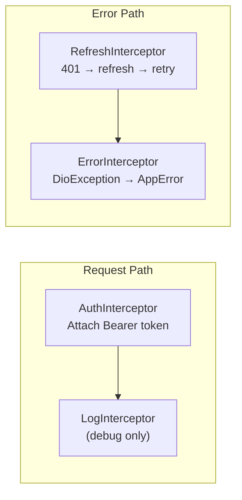
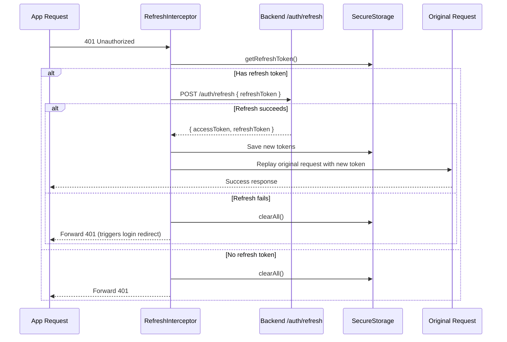

# 08 — Frontend Engineering Handbook

> **Scope**: This document is the definitive reference for CineHub's Flutter frontend. It covers the app bootstrap, Clean Architecture layers, Riverpod state management, GoRouter navigation, the design system, networking, storage, and every implemented feature. A Flutter engineer should be able to maintain and extend this system without reading most of the source code.

---

# 1. Frontend Philosophy

## Why Flutter?

CineHub targets Android, iOS, and (future) Web from a single codebase. Flutter was chosen because:
- **Single codebase for all platforms** — reduces maintenance cost for a small team.
- **60fps compiled UI** — Skia rendering engine produces smooth animations critical for a creative-professional app.
- **Rich widget ecosystem** — Material 3 components, image caching, bottom sheets, and complex scrolling are first-class.
- **Dart's sound null safety** — eliminates entire classes of runtime errors.

## Why Riverpod?

Riverpod (v2, `Notifier` API) was chosen over Provider, BLoC, or GetX because:
- **Compile-time safety** — no `ProviderNotFoundException` at runtime.
- **No `BuildContext` requirement** — providers can be read outside the widget tree (use cases, interceptors).
- **Fine-grained reactivity** — widgets rebuild only when the specific provider they watch changes.
- **`ref.listen`** — enables one-shot side-effects (SnackBars, navigation) without mixing imperative code into the build tree.
- **Testability** — `ProviderScope.overrides` enables clean mocking without dependency injection frameworks.

## Why Clean Architecture?

Every feature follows a three-layer architecture: **Presentation → Domain → Data**. This exists because:
- **Testability**: Domain entities and use cases have zero Flutter/Dio dependencies.
- **Replaceability**: Swapping the backend (REST → GraphQL) only changes the Data layer.
- **Enforced boundaries**: Presentation cannot call Dio directly; it goes through UseCases → Repository → DataSource.

## Why GoRouter?

GoRouter was chosen over Navigator 2.0 or auto_route because:
- **Declarative routing** — routes defined as data, not imperative push/pop.
- **`StatefulShellRoute`** — preserves bottom-nav tab state across navigation.
- **`refreshListenable`** — auth state changes automatically trigger route redirects.
- **Deep link support** — every route is a URL path, ready for universal links.

## Tradeoffs

| Decision | Benefit | Cost |
|---|---|---|
| Clean Architecture per feature | Testable, replaceable layers | 6–10 files per feature (boilerplate) |
| Riverpod `Notifier` over BLoC | Less boilerplate, no code generation | Team must learn Riverpod-specific patterns |
| Sealed classes for state | Exhaustive `switch`, no illegal states | More verbose than `AsyncValue` for simple cases |
| Custom `Result<T>` over `fpdart` | Zero dependencies, lightweight | No `flatMap`, `fold`, or monadic composition |
| Dark-only theme | Consistent cinematic brand | No light mode option for users |

---

# 2. Overall Frontend Architecture

## Layer Diagram

```mermaid
graph TB
    subgraph Presentation["Presentation Layer"]
        Screens["Screens<br/>(ConsumerWidget / ConsumerStatefulWidget)"]
        Widgets["Feature Widgets"]
        Providers["Notifiers + StateProviders"]
    end

    subgraph Domain["Domain Layer"]
        Entities["Entities<br/>(User, Profile, Skill...)"]
        UseCases["Use Cases"]
        RepoContracts["Repository Interfaces"]
    end

    subgraph Data["Data Layer"]
        RepoImpl["Repository Implementations"]
        DataSources["Remote DataSources"]
        DTOs["DTOs<br/>(UserDto, ProfileDto...)"]
    end

    subgraph Core["Core Layer (shared)"]
        Network["ApiClient + Interceptors"]
        Storage["SecureStorage + LocalStorage"]
        Theme["Design System"]
        Router["GoRouter"]
        Error["AppError + Result<T>"]
    end

    Screens --> Providers
    Providers --> UseCases
    UseCases --> RepoContracts
    RepoContracts -.->|implements| RepoImpl
    RepoImpl --> DataSources
    DataSources --> DTOs
    DataSources --> Network
    RepoImpl --> Error

    style Core fill:#1A1A26,stroke:#8B5CF6
    style Domain fill:#1A1A26,stroke:#34D399
    style Data fill:#1A1A26,stroke:#E8A838
    style Presentation fill:#1A1A26,stroke:#EC4899
```



## Dependency Rule

Dependencies flow **inward only**: Presentation → Domain → Data → Core. The Domain layer **never** imports from Presentation or Data. The Data layer **never** imports from Presentation.

---

# 3. Folder Structure

```text
lib/
├── main.dart                      # Entry point — async init + ProviderScope
├── app.dart                       # Root MaterialApp.router (ConsumerWidget)
│
├── core/                          # SHARED infrastructure (no feature logic)
│   ├── config/
│   │   ├── app_config.dart        # Compile-time env → baseUrl, apiVersion
│   │   └── environment.dart       # Enum: development, staging, production
│   │
│   ├── constants/
│   │   └── error_codes.dart       # Machine-readable error code constants
│   │
│   ├── di/
│   │   └── providers.dart         # Core DI: storage, network, platform services
│   │
│   ├── error/
│   │   └── app_error.dart         # Sealed AppError hierarchy
│   │
│   ├── network/
│   │   ├── api_client.dart        # Singleton Dio wrapper
│   │   └── interceptors/
│   │       ├── auth_interceptor.dart    # Attaches Bearer token
│   │       ├── refresh_interceptor.dart # 401 → refresh → retry
│   │       └── error_interceptor.dart   # DioException → AppError
│   │
│   ├── result/
│   │   └── result.dart            # Sealed Result<T> (Success | Failure)
│   │
│   ├── router/
│   │   ├── app_router.dart        # GoRouter config + auth redirect
│   │   └── routes.dart            # All path constants
│   │
│   ├── storage/
│   │   ├── secure_storage.dart    # Keychain/Keystore token storage
│   │   └── local_storage.dart     # SharedPreferences for prefs
│   │
│   └── theme/                     # Design system tokens
│       ├── app_colors.dart        # 35+ named color constants
│       ├── app_typography.dart    # 15 text styles (Inter typeface)
│       ├── app_spacing.dart       # 4-point grid: xxs→epic
│       ├── app_radius.dart        # sm→full border radii
│       ├── app_animations.dart    # Duration + Curve constants
│       ├── app_decorations.dart   # Gradients + shadows
│       └── app_theme.dart         # ThemeData.dark composition
│
├── features/                      # Feature modules (Clean Architecture)
│   ├── auth/                      # [Implemented] Authentication
│   │   ├── data/
│   │   │   ├── datasources/       # AuthRemoteDataSource
│   │   │   ├── models/            # UserDto, AuthResponseDto
│   │   │   └── repositories/     # AuthRepositoryImpl
│   │   ├── domain/
│   │   │   ├── entities/          # User, UserRole
│   │   │   ├── repositories/     # AuthRepository (interface)
│   │   │   └── usecases/         # Login, Register, Logout, ForgotPassword, CheckSession
│   │   └── presentation/
│   │       ├── providers/         # AuthNotifier, AuthState, provider definitions
│   │       ├── screens/           # Login, Register, ForgotPassword, Splash
│   │       └── widgets/           # Auth-specific reusable widgets
│   │
│   └── profile/                   # [Implemented] Profile management
│       ├── data/
│       │   ├── datasources/       # ProfileRemoteDataSource
│       │   ├── models/            # ProfileDto, SkillDto, LocationDto, SocialLinksDto
│       │   └── repositories/     # ProfileRepositoryImpl
│       ├── domain/
│       │   ├── entities/          # Profile, Skill, Location, SocialLinks, ProfilePage
│       │   ├── repositories/     # ProfileRepository (interface)
│       │   └── usecases/         # GetProfile, UpdateProfile, UploadAvatar, Follow, Unfollow, GetFollowers, GetFollowing
│       └── presentation/
│           ├── providers/         # ProfileNotifier, ProfileState, provider definitions
│           ├── screens/           # ProfileScreen, EditProfileScreen, FollowersScreen, FollowingScreen
│           └── widgets/           # 11 profile-specific widgets
│
└── shared/                        # Cross-feature reusable widgets
    └── widgets/
        ├── buttons/               # PrimaryButton, GhostButton, GradientButton...
        ├── chips/                 # StatusChip, SkillChip, FilterChip...
        ├── feedback/              # LoadingOverlay, ErrorBanner, EmptyState...
        ├── inputs/                # CineTextField, CineTextArea, SearchInput...
        └── media/                 # CachedAvatar, ImagePickerButton...
```

### Import Rules

| Source | May Import | Must NOT Import |
|---|---|---|
| `core/` | Dart SDK, Flutter SDK, external packages only | `features/`, `shared/` |
| `features/<x>/domain/` | `core/error/`, `core/result/` | `core/network/`, `core/storage/`, `features/<y>/`, `shared/`, Flutter SDK |
| `features/<x>/data/` | `core/`, `features/<x>/domain/` | `features/<y>/`, `shared/`, `features/<x>/presentation/` |
| `features/<x>/presentation/` | `core/`, `features/<x>/domain/`, `features/<x>/data/` (via providers only), `shared/` | `features/<y>/data/` directly |
| `shared/widgets/` | `core/theme/` | `features/`, `core/network/`, `core/storage/` |

---

# 4. Core Layer

## Config — [app_config.dart](file:///z:/newproject/cinehub/frontend/lib/core/config/app_config.dart)

Compile-time environment selection via `--dart-define=ENV=production`. Three environments:

| Environment | `baseUrl` | Usage |
|---|---|---|
| `development` | `http://10.70.14.31:5000` | Local backend (Android emulator) |
| `staging` | `https://api-staging.cinehub.app` | Pre-release testing |
| `production` | `https://api.cinehub.app` | Live users |

## Theme System

Seven token files compose the design system:

| File | Purpose | Key Values |
|---|---|---|
| [app_colors.dart](file:///z:/newproject/cinehub/frontend/lib/core/theme/app_colors.dart) | 35+ named colors | `background: #08080D`, `primary: #8B5CF6`, `accent: #E8A838` |
| [app_typography.dart](file:///z:/newproject/cinehub/frontend/lib/core/theme/app_typography.dart) | 15 text styles | Inter typeface, 10px–40px, weights 400–700 |
| [app_spacing.dart](file:///z:/newproject/cinehub/frontend/lib/core/theme/app_spacing.dart) | 4-point grid | `xxs=2`, `xs=4`, `sm=8`, `md=12`, `lg=16`, up to `epic=80` |
| [app_radius.dart](file:///z:/newproject/cinehub/frontend/lib/core/theme/app_radius.dart) | Border radii | `sm=4`, `md=8`, `lg=12`, `card=24`, `full=999` |
| [app_animations.dart](file:///z:/newproject/cinehub/frontend/lib/core/theme/app_animations.dart) | Duration + Curve | `instant=100ms`, `fast=180ms`, `normal=280ms`, `slow=400ms` |
| [app_decorations.dart](file:///z:/newproject/cinehub/frontend/lib/core/theme/app_decorations.dart) | Gradients + shadows | `AppGradients.primary`, `AppShadows.primaryGlow` |
| [app_theme.dart](file:///z:/newproject/cinehub/frontend/lib/core/theme/app_theme.dart) | `ThemeData.dark` | Configures 14 Material 3 component themes |

**Rule**: No color literals, spacing literals, or text styles are allowed outside these files.

## Error System

### AppError — [app_error.dart](file:///z:/newproject/cinehub/frontend/lib/core/error/app_error.dart)

A **sealed class** hierarchy with four subtypes:

| Subtype | Trigger | `userMessage` |
|---|---|---|
| `NetworkError` | No connection or timeout | "No internet connection." or "Request timed out." |
| `ServerError` | Non-2xx HTTP response | Backend's error message |
| `AuthError` | 401 status code | Backend's auth error message |
| `UnknownError` | Unexpected exception | "Something went wrong. Please try again." |

### Result\<T\> — [result.dart](file:///z:/newproject/cinehub/frontend/lib/core/result/result.dart)

A **sealed class** replacing `Either<Failure, T>` with zero dependencies:

```dart
sealed class Result<T> {
  static Result<T> success<T>(T data) => Success<T>(data);
  static Result<T> failure<T>(AppError error) => Failure<T>(error);

  R when<R>({
    required R Function(T data) success,
    required R Function(AppError e) failure,
  });
}
```

Every repository method returns `Result<T>` — never throws.

---

# 5. Feature Architecture

## Auth Feature — **[Implemented]**

### Presentation Layer (4 screens, 1 widget file)

| Screen | Widget Type | Purpose |
|---|---|---|
| [SplashScreen](file:///z:/newproject/cinehub/frontend/lib/features/auth/presentation/screens/splash_screen.dart) | `ConsumerStatefulWidget` | Animated brand splash → `checkSession()` → redirect |
| [LoginScreen](file:///z:/newproject/cinehub/frontend/lib/features/auth/presentation/screens/login_screen.dart) | `ConsumerStatefulWidget` | Email/password form, "Forgot password?" link, register link |
| [RegisterScreen](file:///z:/newproject/cinehub/frontend/lib/features/auth/presentation/screens/register_screen.dart) | `ConsumerStatefulWidget` | Multi-field registration with role selector |
| [ForgotPasswordScreen](file:///z:/newproject/cinehub/frontend/lib/features/auth/presentation/screens/forgot_password_screen.dart) | `ConsumerStatefulWidget` | Email input, success/failure feedback |

### Domain Layer (2 entities, 5 use cases, 1 repository interface)

| Entity | Fields | Notes |
|---|---|---|
| `User` | `id`, `email`, `firstName`, `lastName`, `role`, `avatarUrl`, `bio`, `slug`, `isEmailVerified`, `isActive`, `createdAt` | Lightweight auth-only entity |
| `UserRole` | Enum: `user`, `creator`, `producer`, `admin`, `superAdmin` | Parsed from string |

| UseCase | Input | Output |
|---|---|---|
| `LoginUseCase` | `email`, `password` | `Result<User>` |
| `RegisterUseCase` | `email`, `password`, `firstName`, `lastName`, `role` | `Result<User>` |
| `ForgotPasswordUseCase` | `email` | `Result<void>` |
| `LogoutUseCase` | (none) | `Result<void>` |
| `CheckSessionUseCase` | (none) | `Result<User?>` |

### Data Layer (1 datasource, 2 DTOs, 1 repository impl)

| Component | Responsibility |
|---|---|
| `AuthRemoteDataSource` | HTTP calls: login, register, logout, forgotPassword, getMe |
| `AuthResponseDto` | Parses `{ data: { user, tokens } }` response envelope |
| `UserDto` | JSON → `User` entity mapping via `toDomain()` |
| `AuthRepositoryImpl` | Calls datasource, persists tokens to `SecureStorage`, maps errors to `Result` |

---

## Profile Feature — **[Implemented]**

### Presentation Layer (4 screens, 11 widgets)

| Screen | Widget Type | Purpose |
|---|---|---|
| [ProfileScreen](file:///z:/newproject/cinehub/frontend/lib/features/profile/presentation/screens/profile_screen.dart) | `ConsumerStatefulWidget` | Own profile + other user profiles. Loads via `profileNotifierProvider` or `userProfileProvider` |
| [EditProfileScreen](file:///z:/newproject/cinehub/frontend/lib/features/profile/presentation/screens/edit_profile_screen.dart) | `ConsumerStatefulWidget` | Full-page edit form (name, bio, headline, location, social links). Opens skills bottom sheet |
| [FollowersScreen](file:///z:/newproject/cinehub/frontend/lib/features/profile/presentation/screens/followers_screen.dart) | `ConsumerWidget` | Paginated followers list with `UserListTile` |
| [FollowingScreen](file:///z:/newproject/cinehub/frontend/lib/features/profile/presentation/screens/following_screen.dart) | `ConsumerWidget` | Paginated following list with `UserListTile` |

| Widget | Purpose |
|---|---|
| `ProfileAvatar` | Circle avatar with camera icon overlay (opens image picker) |
| `ProfileHeader` | Name, headline, avatar, role badge, cover image |
| `ProfileStats` | Followers / Following / Projects counters (tappable) |
| `ProfileActionButtons` | Edit Profile / Follow / Unfollow / Message buttons |
| `ProfileCompletionCard` | Animated progress bar + percentage + missing suggestions |
| `SkillChipGroup` | Horizontal wrap of skill chips |
| `SocialLinksSection` | Clickable icons for social platforms |
| `ProfileLoadingSkeleton` | Shimmer loading placeholder |
| `EmptyProfileState` | Illustration + message for missing profile data |
| `SkillsBottomSheet` | Full skills editor (add/edit/remove, proficiency 1–5, max 20, suggestions) |
| `UserListTile` | Reusable tile for followers/following lists (avatar, name, headline, tap → profile) |

### Domain Layer (5 entities, 7 use cases, 1 repository interface)

| Entity | Key Fields |
|---|---|
| `Profile` | All `User` fields + `headline`, `coverImageUrl`, `skills`, `location`, `socialLinks`, `followerCount`, `followingCount`, `projectCount`, `completionPercent` (computed) |
| `Skill` | `name`, `category`, `proficiency` (1–5) |
| `Location` | `city`, `state`, `country` |
| `SocialLinks` | `website`, `imdb`, `linkedin`, `instagram`, `youtube`, `vimeo`, `twitter` |
| `ProfilePage` | `profiles: List<Profile>`, `totalDocs`, `totalPages`, `page`, `hasNextPage` |

| UseCase | Signature |
|---|---|
| `GetProfileUseCase` | `call(String userId) → Result<Profile>` |
| `UpdateProfileUseCase` | `call(ProfileUpdateParams) → Result<Profile>` |
| `UploadAvatarUseCase` | `call(File file) → Result<String>` (returns URL) |
| `FollowUserUseCase` | `call({currentUserId, targetUserId}) → Result<void>` |
| `UnfollowUserUseCase` | `call({currentUserId, targetUserId}) → Result<void>` |
| `GetFollowersUseCase` | `call({userId, page}) → Result<ProfilePage>` |
| `GetFollowingUseCase` | `call({userId, page}) → Result<ProfilePage>` |

### Data Layer (1 datasource, 4 DTOs, 1 repository impl)

| Component | Responsibility |
|---|---|
| `ProfileRemoteDataSource` | HTTP calls: getProfile, updateProfile, follow, unfollow, getFollowers, getFollowing, uploadAvatar |
| `ProfileDto` / `ProfilePageDto` | JSON → `Profile` / `ProfilePage` mapping |
| `SkillDto`, `LocationDto`, `SocialLinksDto` | Nested DTO mappers |
| `ProfileRepositoryImpl` | Calls datasource, maps `DioException` → `AppError` → `Result` |

---

# 6. Presentation Layer

## Widget Type Usage

| Widget Type | When To Use | Auth Example | Profile Example |
|---|---|---|---|
| `ConsumerWidget` | Stateless + needs providers | — | `FollowersScreen` |
| `ConsumerStatefulWidget` | Needs `TextEditingController`, `FocusNode`, `ref.listen`, or `initState` | `LoginScreen` | `ProfileScreen`, `EditProfileScreen` |

## `ref.listen` Pattern (One-Shot Events)

Used for SnackBars and navigation after state transitions:

```dart
ref.listen<ProfileState>(profileNotifierProvider, (prev, next) {
  if (next is ProfileSuccess) {
    ScaffoldMessenger.of(context).showSnackBar(SnackBar(content: Text(next.message)));
    notifier.clearStatus(); // Reset to ProfileLoaded
  }
  if (next is ProfileFailure) {
    ScaffoldMessenger.of(context).showSnackBar(SnackBar(content: Text(next.error.userMessage)));
    notifier.clearStatus(); // Reset to ProfileLoaded(previousProfile)
  }
});
```

## `ref.watch` Pattern (Reactive UI)

Used for rebuilding widgets when state changes:

```dart
final state = ref.watch(profileNotifierProvider);
return switch (state) {
  ProfileInitial()  => const SizedBox.shrink(),
  ProfileLoading()  => const ProfileLoadingSkeleton(),
  ProfileLoaded(:final profile) => _buildProfile(profile),
  ProfileUpdating(:final profile) => Stack(children: [_buildProfile(profile), const LoadingOverlay()]),
  ProfileSuccess(:final profile) => _buildProfile(profile),
  ProfileFailure(:final previousProfile) => previousProfile != null ? _buildProfile(previousProfile) : const ErrorWidget(),
};
```

---

# 7. Domain Layer

## Entities

All entities are:
- `final class` — no inheritance, no mutation.
- Immutable — all fields are `final`. Changes produce new instances via `copyWith`.
- Framework-independent — no Flutter imports, no JSON serialization.
- Equality by `id` — `==` and `hashCode` use only the `id` field.

## Use Cases

All use cases follow the same pattern:
- Single `call()` method.
- Takes primitive parameters or a `Params` object.
- Returns `Result<T>` — never throws.
- Delegates to a `Repository` interface (not the implementation).

## Repository Interfaces

Defined as `abstract interface class` — Dart 3.0 syntax. The domain layer owns the contract; the data layer provides the implementation.

---

# 8. Data Layer

## DTO → Entity Mapping

Every DTO has a `toDomain()` method and a `fromJson(Map<String, dynamic>)` factory:

```dart
class ProfileDto {
  factory ProfileDto.fromJson(Map<String, dynamic> json) => ...;
  Profile toDomain() => Profile(
    id: id,
    email: email,
    firstName: firstName,
    // ... map all fields
  );
}
```

**Rule**: DTOs never leak into the domain or presentation layers. The repository always calls `dto.toDomain()` before returning.

## Error Mapping

Both repository implementations (`AuthRepositoryImpl`, `ProfileRepositoryImpl`) share the same error-mapping pattern:

1. Wrap datasource call in `_execute()` try/catch.
2. If `DioException` is caught, check if `ErrorInterceptor` already attached an `AppError`.
3. Otherwise, map by HTTP status code.
4. Wrap in `Result.failure()`.

> [!NOTE]
> This error mapping logic is **duplicated** between `AuthRepositoryImpl` and `ProfileRepositoryImpl`. Both have identical `_mapDioError` and `_extractMessage` methods. This should be extracted to a shared `BaseRepository` mixin.

---

# 9. Riverpod Architecture

## Provider Tree

```mermaid
graph TD
    subgraph Core["Core DI (providers.dart)"]
        FSS["_flutterSecureStorageProvider<br/>Provider&lt;FlutterSecureStorage&gt;"]
        SP["sharedPreferencesProvider<br/>Provider&lt;SharedPreferences&gt;<br/>(overridden at startup)"]
        SS["secureStorageProvider<br/>Provider&lt;SecureStorage&gt;"]
        LS["localStorageProvider<br/>Provider&lt;LocalStorage&gt;"]
        AC["apiClientProvider<br/>Provider&lt;ApiClient&gt;"]
    end

    subgraph Auth["Auth Feature"]
        ADS["_authRemoteDataSourceProvider"]
        AR["authRepositoryProvider"]
        LU["loginUseCaseProvider"]
        RU["registerUseCaseProvider"]
        AN["authNotifierProvider<br/>NotifierProvider&lt;AuthNotifier, AuthState&gt;"]
    end

    subgraph Profile["Profile Feature"]
        PDS["_profileRemoteDataSourceProvider"]
        PR["profileRepositoryProvider"]
        GPU["getProfileUseCaseProvider"]
        PN["profileNotifierProvider<br/>NotifierProvider&lt;ProfileNotifier, ProfileState&gt;"]
        UP["userProfileProvider<br/>FutureProvider.family&lt;Profile, String&gt;"]
        FP["followersProvider<br/>FutureProvider.family&lt;ProfilePage, (String, int)&gt;"]
    end

    SP --> LS
    FSS --> SS
    SS --> AC
    AC --> ADS
    SS --> AR
    ADS --> AR
    AR --> LU & RU
    LU & RU --> AN

    AC --> PDS
    PDS --> PR
    PR --> GPU
    GPU --> PN & UP
    PR --> FP

    style Core fill:#1A1A26,stroke:#8B5CF6
    style Auth fill:#1A1A26,stroke:#34D399
    style Profile fill:#1A1A26,stroke:#E8A838
```



## Provider Types Used

| Type | Count | Purpose |
|---|---|---|
| `Provider<T>` | ~15 | Singleton services (ApiClient, repositories, use cases) |
| `NotifierProvider<N, S>` | 2 | `AuthNotifier`, `ProfileNotifier` — stateful, mutable |
| `FutureProvider.family` | 3 | `userProfileProvider`, `followersProvider`, `followingProvider` — read-only async data |

## State Lifecycle

`Notifier.build()` returns the initial state. All mutations are methods on the Notifier that set `state = ...`.

**Auth State Machine:**
```
AuthInitial → [checkSession] → AuthAuthenticated | AuthUnauthenticated
AuthUnauthenticated → [login/register] → AuthLoading → AuthAuthenticated | AuthFailure
AuthAuthenticated → [logout] → AuthLoading → AuthUnauthenticated
```

**Profile State Machine:**
```
ProfileInitial → [loadProfile] → ProfileLoading → ProfileLoaded | ProfileFailure
ProfileLoaded → [updateProfile] → ProfileUpdating → ProfileSuccess | ProfileFailure
ProfileLoaded → [followUser] → ProfileUpdating → ProfileSuccess | ProfileFailure
ProfileSuccess → [clearStatus] → ProfileLoaded
ProfileFailure → [clearStatus] → ProfileLoaded (if previousProfile exists)
```

## Known Issue: Missing `autoDispose`

> [!WARNING]
> `followersProvider` and `followingProvider` are `FutureProvider.family` without `.autoDispose`. Once fetched, data remains cached indefinitely. Navigating away and returning does not re-fetch. This causes **stale data** when users follow/unfollow and navigate back.

---

# 10. GoRouter

## Route Tree

```mermaid
graph TD
    Root["/"] --> Splash["/splash<br/>SplashScreen"]
    Root --> Login["/login<br/>LoginScreen"]
    Root --> Register["/register<br/>RegisterScreen"]
    Root --> ForgotPwd["/forgot-password<br/>ForgotPasswordScreen"]

    Root --> Shell["StatefulShellRoute<br/>_AppShell (BottomNav)"]
    Shell --> Home["/shell/home<br/>_HomeScreen ★"]
    Shell --> Discover["/shell/discover<br/>_DiscoverScreen ★"]
    Shell --> Projects["/shell/projects<br/>_ProjectsScreen ★"]
    Shell --> Messages["/shell/messages<br/>_MessagesScreen ★"]
    Shell --> Profile["/shell/profile<br/>ProfileScreen"]

    Root --> EditProfile["/profile/edit<br/>EditProfileScreen"]
    Root --> UserProfile["/profile/user/:id<br/>ProfileScreen"]
    Root --> Followers["/profile/user/:id/followers<br/>FollowersScreen"]
    Root --> Following["/profile/user/:id/following<br/>FollowingScreen"]

    style Splash fill:#2D2250
    style Login fill:#2D2250
    style Register fill:#2D2250
    style ForgotPwd fill:#2D2250
    style Shell fill:#1A1A26,stroke:#8B5CF6
```



> ★ = Placeholder screen (Phase 4+)

## Auth Redirect Guard

The router watches `authNotifierProvider` via a custom `_AuthChangeNotifier` (a `ChangeNotifier` that calls `notifyListeners()` on every auth state transition). The redirect function enforces:

| Auth State | On Auth Route | On Protected Route |
|---|---|---|
| `AuthInitial` / `AuthLoading` | Stay on `/splash` | Redirect to `/splash` |
| `AuthAuthenticated` | Redirect to `/shell/home` | Pass through |
| `AuthUnauthenticated` / `AuthFailure` | Pass through | Redirect to `/login` |

## Protected vs Public Routes

| Public (no auth required) | Protected (auth required) |
|---|---|
| `/splash`, `/login`, `/register`, `/forgot-password` | Everything else: `/shell/*`, `/profile/*` |

---

# 11. Design System

## Shared Widgets — [shared/widgets/](file:///z:/newproject/cinehub/frontend/lib/shared/widgets)

| Category | File | Key Widgets |
|---|---|---|
| Buttons | `buttons.dart` | `PrimaryButton`, `GhostButton`, `GradientButton`, `IconActionButton` |
| Chips | `chips.dart` | `StatusChip`, `SkillChip`, `FilterChip`, `RoleChip` |
| Feedback | `feedback_widgets.dart` | `LoadingOverlay`, `ErrorBanner`, `EmptyState`, `SuccessBanner` |
| Inputs | `inputs.dart` | `CineTextField`, `CineTextArea`, `CineSearchInput`, `CineDropdown` |
| Media | `media_widgets.dart` | `CachedAvatar`, `ImagePickerButton`, `MediaThumbnail` |

## Component Themes

[AppTheme.dark](file:///z:/newproject/cinehub/frontend/lib/core/theme/app_theme.dart) configures 14 component themes:

| Component | Key Customizations |
|---|---|
| `AppBarTheme` | Transparent background, no elevation, transparent status bar |
| `NavigationBarTheme` | `surface` background, `primaryMuted` indicator, 68px height |
| `CardTheme` | `surface` color, 0.5px border, `card` radius (24px) |
| `InputDecorationTheme` | `surfaceElevated` fill, `borderFocus` on focus, all 6 border states |
| `ElevatedButtonTheme` | `primary` background, 48px height, no elevation/shadow |
| `OutlinedButtonTheme` | `border` color side, 44px height |
| `ChipTheme` | `surfaceElevated` background, `full` radius (pill) |
| `BottomSheetTheme` | `surface` background, top 24px radius |
| `DialogTheme` | `surfaceElevated` background, `xl` radius |
| `SnackBarTheme` | `surfaceOverlay` background, floating behavior |
| `ProgressIndicatorTheme` | `primary` color, `surfaceElevated` track |
| `SwitchTheme` | `primary` when selected, `textTertiary` thumb otherwise |
| `ListTileTheme` | Transparent background, `lg` horizontal padding |
| `PageTransitionsTheme` | Fade-up on Android, Cupertino on iOS |

---

# 12. Networking

## ApiClient — [api_client.dart](file:///z:/newproject/cinehub/frontend/lib/core/network/api_client.dart)

A singleton Dio wrapper. All network traffic goes through this class.

| Config | Value |
|---|---|
| `baseUrl` | `AppConfig.apiBase` (e.g., `http://10.70.14.31:5000/api/v1`) |
| `connectTimeout` | 15 seconds |
| `receiveTimeout` | 30 seconds |
| `sendTimeout` | 15 seconds |
| Content-Type | `application/json` |

### Interceptor Chain



### Token Refresh Flow — [refresh_interceptor.dart](file:///z:/newproject/cinehub/frontend/lib/core/network/interceptors/refresh_interceptor.dart)



**Key Design**: `RefreshInterceptor` uses a separate `Dio()` instance for the refresh call to avoid re-triggering the interceptor chain. The `_isRefreshing` boolean prevents parallel refresh attempts.

---

# 13. Storage

## SecureStorage — [secure_storage.dart](file:///z:/newproject/cinehub/frontend/lib/core/storage/secure_storage.dart)

Backed by `FlutterSecureStorage` (Keychain on iOS, EncryptedSharedPreferences on Android).

| Method | Key | Purpose |
|---|---|---|
| `saveAccessToken` / `getAccessToken` / `deleteAccessToken` | `access_token` | JWT access token lifecycle |
| `saveRefreshToken` / `getRefreshToken` / `deleteRefreshToken` | `refresh_token` | JWT refresh token lifecycle |
| `clearAll()` | * | Logout — wipes all credentials |
| `hasSession()` | `access_token` | Quick boolean check (does NOT validate with server) |

## LocalStorage — [local_storage.dart](file:///z:/newproject/cinehub/frontend/lib/core/storage/local_storage.dart)

Backed by `SharedPreferences`. Stores non-sensitive UI preferences:

| Key | Type | Default | Purpose |
|---|---|---|---|
| `theme_mode` | `String` | `'dark'` | Theme preference |
| `language` | `String` | `'en'` | Locale preference |
| `onboarded` | `bool` | `false` | First-launch onboarding flag |

---

# 14. State Management

## State Transition Pattern

Both `AuthNotifier` and `ProfileNotifier` follow an identical pattern:

1. Set `state = Loading`.
2. `await` the use case.
3. `result.when(success: ... , failure: ...)` → set `state = Success | Failure`.
4. UI reacts via `ref.watch` (rebuilds) and `ref.listen` (one-shot effects).

## Immutable State

All state classes are `sealed` + `final class`. State carries all data needed for rendering:

- `ProfileLoading` carries no data → show skeleton.
- `ProfileLoaded(profile)` carries the profile.
- `ProfileUpdating(profile)` carries the profile → show content + loading overlay.
- `ProfileSuccess(profile, message)` → show content + SnackBar.
- `ProfileFailure(error, previousProfile?)` → show error or keep previous content visible.

**Rule**: After handling `ProfileSuccess` or `ProfileFailure`, screens **must** call `notifier.clearStatus()` to reset to `ProfileLoaded`, preventing stale one-shot events.

---

# 15. Performance

| Optimization | Implementation | Status |
|---|---|---|
| **`const` constructors** | All stateless widgets and states use `const` | **[Implemented]** |
| **Sealed class `switch`** | Exhaustive matching avoids unnecessary casts | **[Implemented]** |
| **Lean interceptors** | `AuthInterceptor` skips auth endpoints (`_skipPaths`) | **[Implemented]** |
| **FutureProvider.family** | Cache per `(userId, page)` tuple | **[Implemented]** — but lacks `autoDispose` |
| **Shimmer loading** | `ProfileLoadingSkeleton` prevents layout shifts | **[Implemented]** |
| **Image caching** | `CachedAvatar` in shared widgets | **[Implemented]** |

### Known Bottlenecks

1. **No `autoDispose` on family providers**: `followersProvider`, `followingProvider`, and `userProfileProvider` retain cached data forever, causing stale reads.
2. **`ProfileNotifier` is global**: One `profileNotifierProvider` is shared between own-profile tab and other-user profiles. Loading user B's profile replaces user A's state. See §17 Debt FE-003.
3. **Large `EditProfileScreen`**: At ~14KB, this screen handles form fields, skills editor, social links, location, and avatar upload all in one widget. Should be decomposed.

---

# 16. Testing

## Current Tests

> [!CAUTION]
> **No unit, widget, or integration tests exist.** The `test/` directory contains only the default Flutter counter app test.

## Recommended Testing Strategy

| Layer | What to Test | Tool |
|---|---|---|
| Domain (entities) | `completionPercent` logic, `copyWith` correctness, `UserRole.fromString` | `flutter_test` (unit) |
| Domain (use cases) | Delegation to repository, error propagation | `flutter_test` + `mockito` |
| Data (DTOs) | `fromJson` / `toDomain` mapping with edge cases | `flutter_test` (unit) |
| Data (repositories) | Error mapping: `DioException` → `Result.failure` | `flutter_test` + `mocktail` |
| Presentation (notifiers) | State machine transitions | `flutter_test` + `ProviderScope.overrides` |
| Widgets | SnackBar on `ProfileSuccess`, skeleton on `ProfileLoading` | `flutter_test` (widget) |
| Integration | Full login → profile → edit → logout flow | `integration_test` package |

---

# 17. Technical Debt

| ID | Severity | Issue | Impact | Recommended Fix |
|---|---|---|---|---|
| FE-001 | **High** | `_mapDioError()` and `_extractMessage()` duplicated in `AuthRepositoryImpl` and `ProfileRepositoryImpl` (~30 identical lines) | Every new feature must copy-paste error mapping | Extract to a `BaseRemoteRepository` mixin or abstract class |
| FE-002 | **High** | `followersProvider`, `followingProvider`, `userProfileProvider` lack `.autoDispose` | Stale data after follow/unfollow. Memory grows unbounded in long sessions | Add `.autoDispose` to all family providers |
| FE-003 | **High** | `profileNotifierProvider` is a single global instance shared for own profile and other users' profiles | Viewing another user's profile replaces own profile state, causing data loss when returning to the profile tab | Use `family` provider or separate `ownProfileProvider` and `userProfileProvider` |
| FE-004 | **Medium** | `EditProfileScreen` is ~14KB / 350+ lines — handles avatar upload, form fields, skills sheet, social links in one file | Hard to maintain, slow to compile in incremental builds | Decompose into `AvatarSection`, `BasicInfoSection`, `SocialLinksSection`, `SkillsSection` sub-widgets |
| FE-005 | **Medium** | `VoidResultX` extension defined identically in both `auth_repository.dart` and `profile_repository.dart` | Duplicate code, maintenance risk | Move to `core/result/result.dart` |
| FE-006 | **Medium** | 4 placeholder screens (`_HomeScreen`, `_DiscoverScreen`, `_ProjectsScreen`, `_MessagesScreen`) are defined inline in `app_router.dart` | Bloats the router file, violates single-responsibility | Move placeholders to separate files in a `shared/screens/` folder |
| FE-007 | **Low** | `auth_notifier.dart` is a pure barrel re-export of `auth_providers.dart` — exists only for "backward compatibility" | Misleading file name; imports are confusing | Inline the `AuthNotifier` class into a dedicated file or remove the barrel |
| FE-008 | **Low** | No light theme support — `AppTheme.dark` is the only theme | Users in bright environments have no option | Add `AppTheme.light` and wire to `LocalStorage.getThemeMode()` |
| FE-009 | **Low** | `uploadAvatar` in `ProfileRemoteDataSource` uses `_client.post` instead of `_client.upload` | Missing `onSendProgress` callback — no upload progress indicator | Use `_client.upload()` with progress callback |
| FE-010 | **Low** | `ErrorCodes` constants (e.g., `AUTH_001`) don't match backend codes (e.g., `AUTH_EMAIL_TAKEN`) | Frontend error codes are never compared to backend codes in practice | Align constants or remove if unused |

---

# 18. Frontend Roadmap

| Status | Item |
|---|---|
| **[Completed]** | Auth feature (login, register, forgot password, splash, session check) |
| **[Completed]** | Profile feature (view, edit, avatar upload, skills editor, completion card) |
| **[Completed]** | Social graph (follow/unfollow, followers list, following list) |
| **[Completed]** | Design system (colors, typography, spacing, radius, animations, decorations, shared widgets) |
| **[Completed]** | Core infrastructure (ApiClient, interceptors, SecureStorage, LocalStorage, GoRouter, AppError, Result) |
| **[Current]** | Documentation and quality assurance |
| **[Planned]** | Home feed screen (Phase 4) |
| **[Planned]** | Projects feature (Phase 5) |
| **[Planned]** | Discovery / search feature (Phase 6) |
| **[Planned]** | Messaging feature — Socket.IO (Phase 7) |
| **[Future]** | AI Hub (script generation, budget analysis, trailer generation) |
| **[Future]** | Portfolio feature |
| **[Future]** | Notifications feature |
| **[Future]** | Settings feature (theme toggle, language, account deletion) |
| **[Blocked]** | Light theme — design tokens exist only for dark mode |

---

# 19. Cross References

| Topic | Document |
|---|---|
| System architecture, Clean Architecture philosophy | [03_ARCHITECTURE.md](file:///z:/newproject/cinehub/docs/brain/03_ARCHITECTURE.md) |
| Design system tokens and visual guidelines | [04_DESIGN_SYSTEM.md](file:///z:/newproject/cinehub/docs/brain/04_DESIGN_SYSTEM.md) |
| Backend API endpoints consumed by this frontend | [07_BACKEND.md](file:///z:/newproject/cinehub/docs/brain/07_BACKEND.md) |
| API endpoint specifications and payloads | [09_API.md](file:///z:/newproject/cinehub/docs/brain/09_API.md) |
| Phase completion and acceptance criteria | [13_PHASES.md](file:///z:/newproject/cinehub/docs/brain/13_PHASES.md) |
| UI/UX design guidelines | [11_UI_GUIDELINES.md](file:///z:/newproject/cinehub/docs/brain/11_UI_GUIDELINES.md) |
